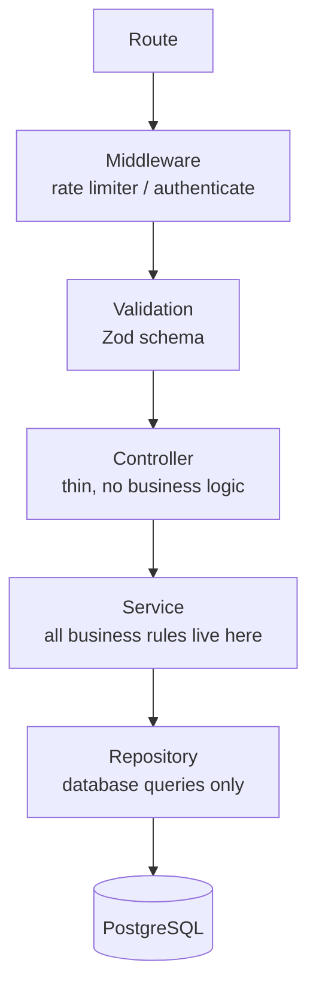
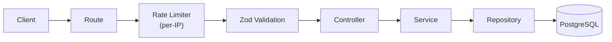
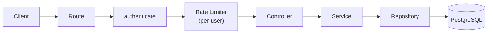
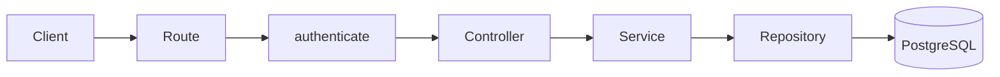
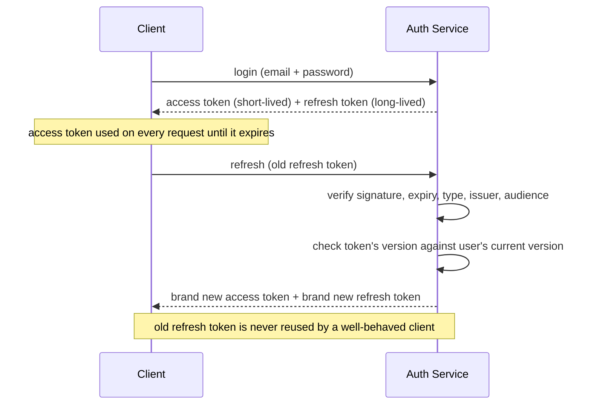
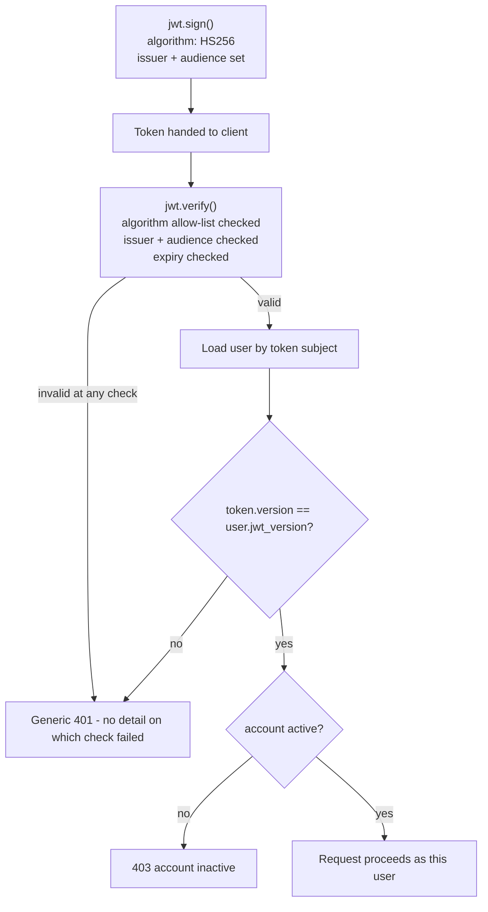
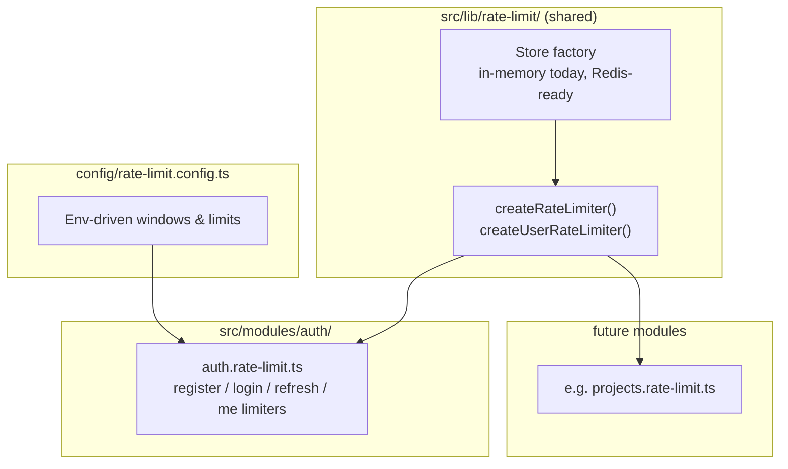
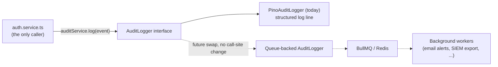

# Authentication — Architecture

**Audience:** developers and contributors who want to understand how the system fits together
before reading code. Read [`overview.md`](overview.md) first if you haven't — this document
assumes you already know _why_ the system works this way and focuses on _how_.

## Layered design

The module follows the same layering as the rest of the backend:

Each layer has exactly one job:

| Layer      | Job                                                                           | Must NOT do                           |
| ---------- | ----------------------------------------------------------------------------- | ------------------------------------- |
| Route      | Wire middleware + schema + controller together                                | Contain logic                         |
| Middleware | Rate-limit or authenticate the request                                        | Touch business rules                  |
| Validation | Reject malformed input before it reaches the controller                       | —                                     |
| Controller | Read `req`, call one service method, send a response                          | Talk to the database, know about JWTs |
| Service    | Hash passwords, issue/verify tokens, enforce account rules, emit audit events | Know about `req`/`res`                |
| Repository | Run Drizzle queries                                                           | Throw HTTP errors, know about JWTs    |

This separation is why, for example, adding audit logging didn't touch the controller or routes at
all — it's a service-layer concern.

## Request flows

Public endpoints (register, login, refresh) are rate-limited **before** validation — rejecting
abusive traffic is cheaper than validating it first:

`/me` is authenticated **before** it's rate-limited, because the limiter keys by user ID and
`req.user` doesn't exist until `authenticate` has run:

`/logout` is authenticated only — no rate limiter, no request body to validate:

## Why two tokens?

A single long-lived token is convenient but dangerous: if it leaks, it's valid until it expires —
which, for a token you don't want users re-entering their password to renew every few minutes,
would have to be days or weeks.

Splitting into two solves this:

- **Access token** — short-lived (minutes), sent on every request, proves identity. If it leaks,
  the exposure window is small.
- **Refresh token** — longer-lived (days), used _only_ to obtain a new access token, never sent on
  ordinary requests. Smaller attack surface because it's used rarely.

Both tokens are structurally identical JWTs signed with the same secret — they're told apart by a
`type` claim (`access` vs `refresh`), which every verification path checks explicitly. This is why
a stolen access token can never be replayed against `/refresh`, and vice versa.

## JWT lifecycle

The version check is what makes logout instant and global — see
[JWT versioning, in the module README](../../src/modules/auth/README.md#jwt-versioning) for the
implementation, and [`security.md`](security.md#jwt-versioning) for why this approach was chosen
over a token blacklist.

## Rate limiting architecture

Rate limiting is built as generic, reusable infrastructure — not something specific to auth — so
future modules don't reinvent it:

Every limiter logs a `warn`-level event (limiter name, IP, path) when it trips, and every limiter
is disabled under `NODE_ENV=test` so integration tests aren't throttled by shared time windows.

## Audit event flow

The service only ever depends on the `AuditLogger` interface, never the concrete Pino
implementation — which is what makes the "future swap" possible without touching
`auth.service.ts`. See [`roadmap.md`](roadmap.md#planned-features) (background workers / BullMQ row).

## See also

- [`overview.md`](overview.md) — why this system exists, in plain language
- [`security.md`](security.md) — each security control and why it exists
- [`roadmap.md`](roadmap.md) — what's planned and how this design accommodates it
- [`src/modules/auth/README.md`](../../src/modules/auth/README.md) — file-by-file implementation reference
