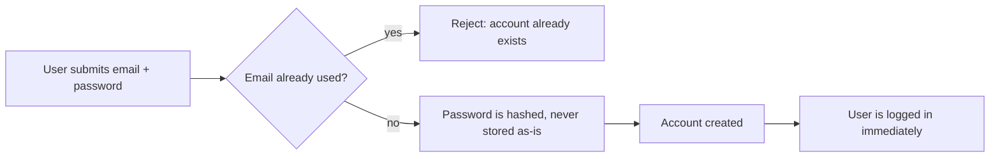
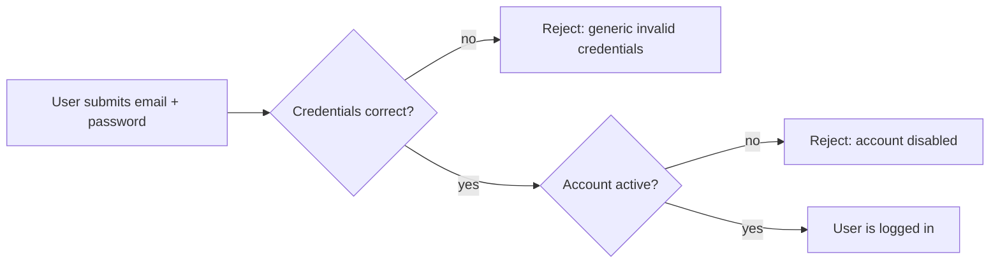

# Authentication — Overview

**Audience:** anyone — new contributors, product managers, or a developer returning to this
project after months away. No backend experience assumed.

**Purpose of this document:** explain _why_ the authentication system exists and _what_ it does,
before any implementation detail. For how it's built, see [`architecture.md`](architecture.md).
For security specifics, see [`security.md`](security.md). For what's planned next, see
[`roadmap.md`](roadmap.md).

## Why does this exist?

Every product needs to answer one question before it does anything else: **who is this?** Kaizen
is a project/issue-tracking product (in the spirit of Jira) — accounts, permissions, and
ownership matter everywhere. The authentication module is where that question gets answered once,
correctly, so every other part of the product (Projects, Issues, Comments, ...) can simply ask
"is there a valid, logged-in user?" instead of re-solving identity itself.

Centralizing this also means security fixes, password policy changes, and audit requirements are
made in one place instead of N places.

## What can a user do?

| Action               | What it means for the user                                                       |
| -------------------- | -------------------------------------------------------------------------------- |
| Register             | Create an account with an email and password                                     |
| Login                | Prove they own that account, and receive a "session" (see below)                 |
| Stay logged in       | Their session refreshes quietly in the background without re-entering a password |
| Logout               | End that session — and every other device's session — immediately                |
| View profile (`/me`) | Confirm who they're currently logged in as                                       |

## What does authentication protect?

Anything built on top of it. A route in a future module (say, "delete this project") will require
a valid session before it runs. Authentication itself doesn't decide _what_ a user is allowed to
do (that's authorization, a deliberately separate concern — see [`roadmap.md`](roadmap.md)) — it
only establishes _who_ is asking.

It also protects the system itself: rate limiting and audit logging (below) exist to make
credential-guessing and account takeover attempts slow, visible, and traceable.

## What happens, in plain terms

### Registration

### Login

Note the login failure message is deliberately the same whether the email doesn't exist _or_ the
password is wrong. This is intentional — see [Why generic errors](security.md#generic-authentication-errors)
in the security doc.

### Staying logged in ("refresh")

A login session is really two parts: a short-lived pass (~15 minutes) that proves identity on
every request, and a longer-lived pass (~7 days) used only to quietly request a new short-lived
pass without asking the user to log in again. This trade-off — short-lived by default, renewable
in the background — is explained in [`architecture.md`](architecture.md#why-two-tokens).

### Logout

Logout doesn't just forget one session — it invalidates **every** session for that account across
every device at once. If a user's laptop is stolen, logging out from their phone locks the laptop
out too.

## What are audit events?

Every meaningful security action (a registration, a successful or failed login, a token refresh, a
logout) is recorded as a structured log entry: what happened, to which account, from which
network address, and when. This isn't visible to end users — it exists so that, months from now,
someone investigating "was this account compromised?" has an actual trail to look at instead of
guesswork.

## What does rate limiting protect against?

Without it, an attacker (or a buggy script) could attempt thousands of password guesses per
second, or spam account creation. Rate limiting caps how many attempts are allowed from one source
in a given time window — different endpoints get different limits, because the risk profile
differs (guessing a password is riskier to allow rapidly than refreshing an existing session).

## Why these particular design choices?

| Choice                                | Why                                                                                                                                        |
| ------------------------------------- | ------------------------------------------------------------------------------------------------------------------------------------------ |
| Modular, self-contained module        | Auth can be read, tested, and reasoned about without touching every other feature; future modules depend on it, it depends on nothing else |
| Token-based sessions (JWT)            | No server-side session storage needed for every request — see [`architecture.md`](architecture.md)                                         |
| Two tokens, not one                   | Limits how much damage a stolen token can do (see [`security.md`](security.md))                                                            |
| Instant "logout everywhere"           | A real product requirement (lost device, suspected compromise) without building a session database                                         |
| Rate limiting on public endpoints     | Cheap to add, closes an entire class of brute-force/abuse risk                                                                             |
| Audit logging                         | Security incidents are investigated after the fact — you need a trail _before_ you know you'll need one                                    |
| Generic, non-revealing error messages | Prevents an attacker from learning which emails have accounts                                                                              |

## Where to go next

- **Building or reviewing a feature in this area?** → [`architecture.md`](architecture.md)
- **Evaluating or auditing security posture?** → [`security.md`](security.md)
- **Planning what comes after this?** → [`roadmap.md`](roadmap.md)
- **Working directly in the code?** → [`src/modules/auth/README.md`](../../src/modules/auth/README.md)
