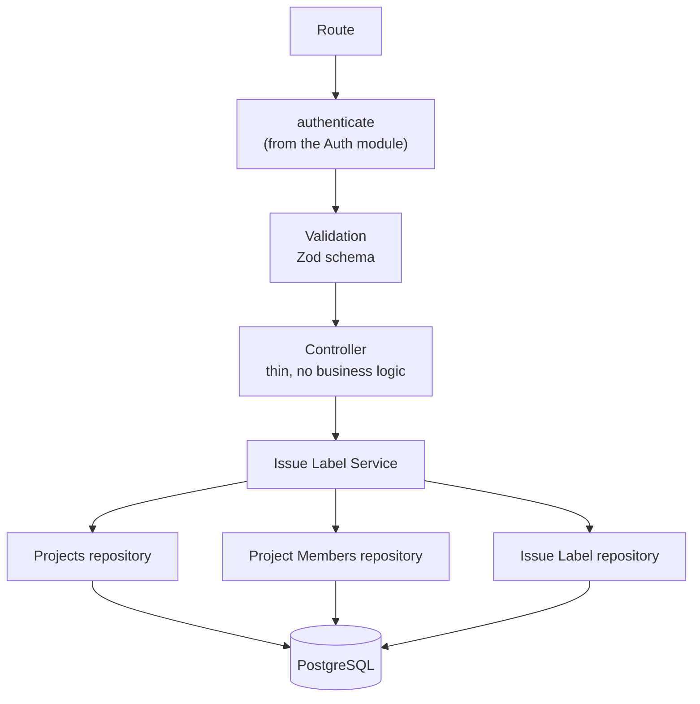
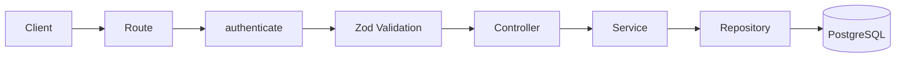
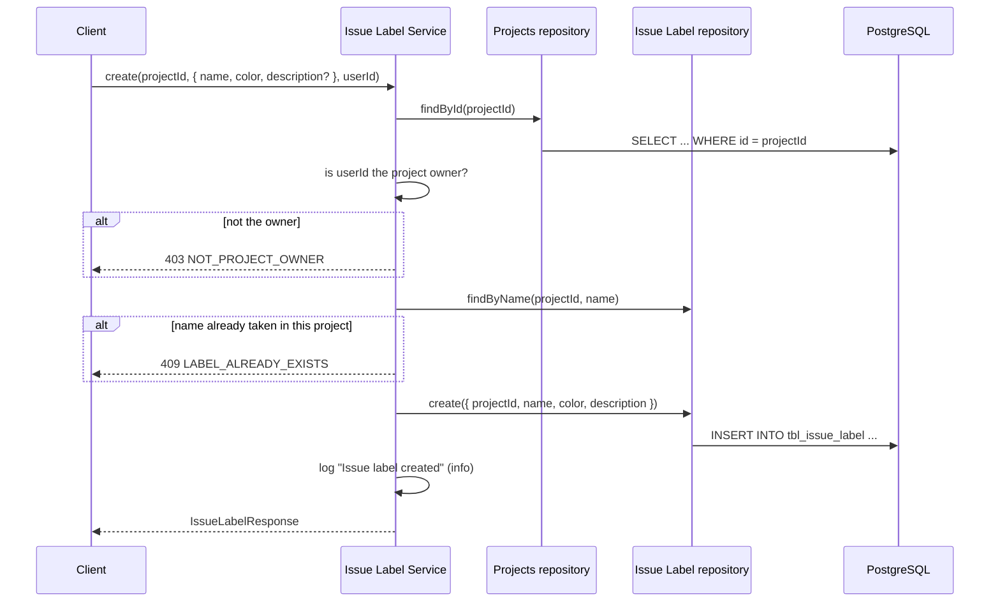
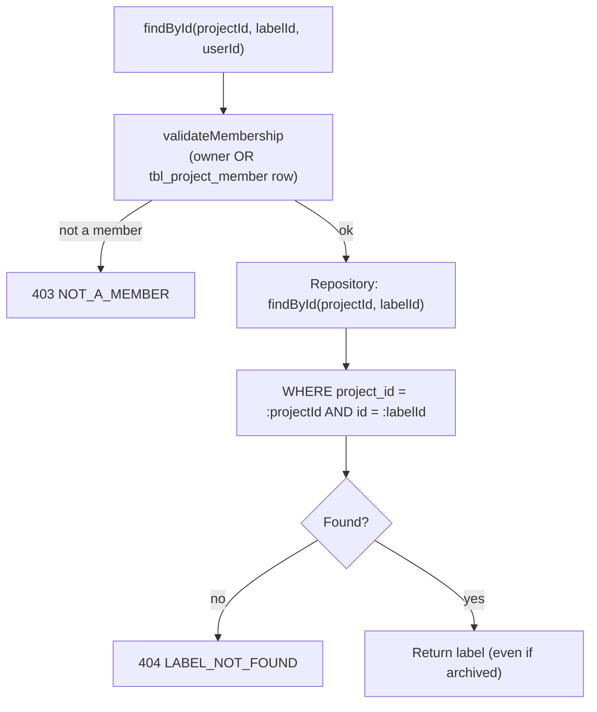
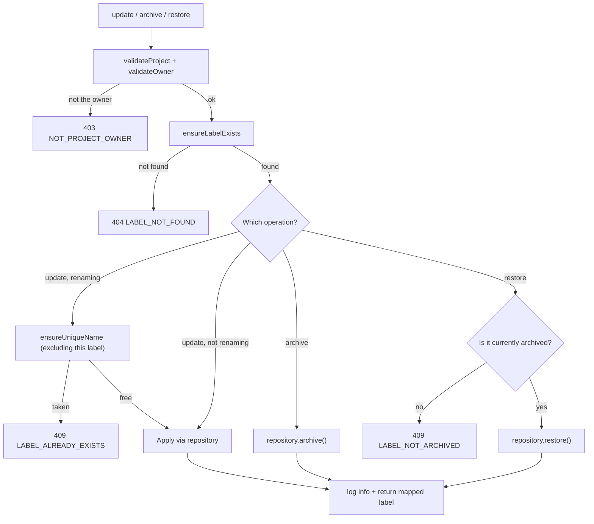

# Issue Label — Architecture

**Audience:** developers and contributors who want to understand how the system fits together
before reading code. Read [`overview.md`](overview.md) first if you haven't — this document
assumes you already know _why_ the system works this way and focuses on _how_.

## Layered design

The module follows the same layering as [Issue Type](../issue-type/architecture.md), reaching
into the Projects and Project Members repositories directly:

| Layer      | Job                                                                                     | Must NOT do                                                        |
| ---------- | --------------------------------------------------------------------------------------- | ------------------------------------------------------------------ |
| Route      | Wire `authenticate` + Zod schema + controller together                                  | Contain logic                                                      |
| Controller | Read `req`, call one service method, send a response                                    | Talk to the database, know about ownership or membership           |
| Service    | Validate project/owner/membership, enforce unique-name and restore rules, map responses | Know about `req`/`res`                                             |
| Repository | Run Drizzle queries against `tbl_issue_label`, never filtering archived rows            | Throw HTTP errors, know about ownership, membership, or uniqueness |

The repository's refusal to filter `archived` rows is deliberate: `findById` and `findMany` must
keep returning archived labels, or `restore()` would have no way to locate the row it's supposed to
bring back. Every "should this be hidden" decision lives in the service, never the repository.

## Request flow

`GET /` (list) takes no query parameters — a project's label list is expected to stay small, so
there's no filtering or pagination here.

## Create flow

## Read flow (`findById`, `findAll`)

Reads use `validateMembership` (owner or member); writes use `validateOwner` (owner only) — see
[`security.md`](security.md#membership-for-reads-ownership-for-writes) for why.

## Update / archive / restore flow

Archiving does not check whether the label is already archived — an already-archived label can be
archived again without error (idempotent). Restoring is the mirror image: it explicitly requires
the label to already be archived.

## No locking (a deliberate simplification)

Unlike [Issue Type](../issue-type/architecture.md#locking), [Issue
Priority](../issue-priority/architecture.md#level-assignment-and-locking), and [Issue
Status](../issue-status/architecture.md), this module's repository has no transaction-aware
executor and no per-project advisory lock. `ensureUniqueName`'s `findByName` check and the
subsequent `create`/`update` are two separate, unlocked statements. The database's
`unique(project_id, name)` constraint on `tbl_issue_label` still exists as a backstop, but the
service does not catch or translate its violation — so two concurrent requests for the same new
name could both pass the pre-check, and the losing write would surface as a raw `500
INTERNAL_SERVER_ERROR` instead of a clean `409 LABEL_ALREADY_EXISTS`. This is a known, narrow race
window, not an oversight — see [`roadmap.md`](roadmap.md) for closing it the same way the sibling
modules do.

## Logging architecture

Like [Issue Type](../issue-type/architecture.md#logging-architecture), this module uses the shared
Pino `logger` directly rather than the queue-ready `AuditLogger`:

| Level   | When                                                                                            |
| ------- | ----------------------------------------------------------------------------------------------- |
| `info`  | A mutation succeeded: created, updated, archived, restored                                      |
| `warn`  | A request was rejected: not found, not owner, not a member, name conflict, restore-not-archived |
| `debug` | A read succeeded (single label or list)                                                         |

Every log line includes `projectId`, `labelId` (where applicable), and `userId`.

## See also

- [`overview.md`](overview.md) — why this system exists, in plain language
- [`security.md`](security.md) — each control and why it exists
- [`roadmap.md`](roadmap.md) — what's planned and how this design accommodates it
- [`src/modules/issue-label/README.md`](../../src/modules/issue-label/README.md) — file-by-file implementation reference
