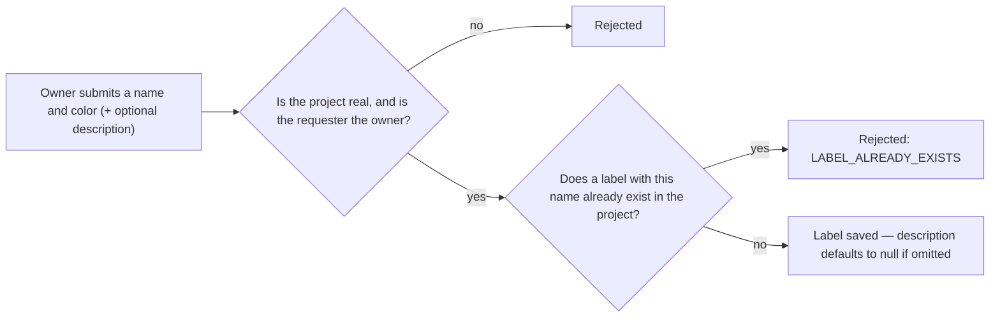
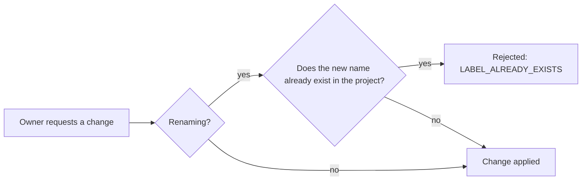

# Issue Label — Overview

**Audience:** anyone — new contributors, product managers, or a developer returning to this
project after months away. No backend experience assumed.

**Purpose of this document:** explain _why_ the Issue Label module exists and _what_ it does,
before any implementation detail. For how it's built, see [`architecture.md`](architecture.md).
For security specifics, see [`security.md`](security.md). For what's planned next, see
[`roadmap.md`](roadmap.md).

## Why does this exist?

Status, priority, and type each describe one dimension of an issue, and an issue can only hold one
value of each. Labels are different: they're free-form, project-defined tags — `Frontend`,
`Needs Design`, `Blocked` — meant to be layered on top of an issue in any combination, for
organization that doesn't fit neatly into a single field.

This module intentionally does **one thing**: manage the list of labels available to a project. It
does not attach labels to issues, does not group labels, and does not generate labels
automatically — that wiring, along with organization-wide labels and AI-assisted suggestions, is
deliberately deferred (see [`roadmap.md`](roadmap.md)) so this piece can ship as a small,
well-tested foundation first.

## What can a user do?

| Action          | What it means for the user                                            |
| --------------- | --------------------------------------------------------------------- |
| Create a label  | Add a new named label, with a color, to a project                     |
| View a label    | Read a single label's details                                         |
| List labels     | See every label defined for a project                                 |
| Update a label  | Rename it, or change its color or description                         |
| Archive a label | Retire it without deleting it — it stops being offered for new issues |
| Restore a label | Bring an archived label back                                          |

There is no delete action. A label can only be archived or restored — see
[Why there's no delete endpoint](security.md#no-delete-endpoint-only-archive-and-restore).

## What happens, in plain terms

### Creating a label

`name` and `color` are both required; `description` is optional with no default value.

### Updating a label

Uniqueness is only re-checked when the name is actually changing — updating just the color or
description never triggers a duplicate-name lookup.

### Archiving vs. restoring

There is no delete here, only these two states:

- **Archiving** retires a label from active use without removing the row — any issue that later
  references it (once label assignment ships) keeps working, but the label stops being something a
  client would offer for new use.
- **Restoring** is the only way back from archived; it fails if the label isn't currently archived,
  mirroring the same rule the [Issue Type module](../issue-type/overview.md#archiving-vs-restoring)
  uses for restoring a type.

A label keeps its id forever once created, because an issue may eventually hold a reference to it
that must always resolve to something.

## Color and description

| Field         | Values                  | Default |
| ------------- | ----------------------- | ------- |
| `color`       | required, hex `#RRGGBB` | —       |
| `description` | optional, free text     | `null`  |

Neither field is interpreted by this module — they exist so a future UI can visually tag and
describe a label. Unlike the Issue Type module, this module defines no default label set; projects
start with zero labels, created by the owner as needed.

## Why these particular design choices?

| Choice                                                | Why                                                                                                                                     |
| ----------------------------------------------------- | --------------------------------------------------------------------------------------------------------------------------------------- |
| Only the project owner can write, any member can read | Labels define a shared vocabulary for the whole project — a looser, per-member write model would let any member reshape it for everyone |
| Name unique per project, not globally                 | Two different projects should both be free to have a "Bug" label without colliding                                                      |
| Archive instead of delete                             | Issues may reference a label id once assignment ships; deleting the row out from under them would leave a dangling reference            |
| No default labels seeded on project creation          | Unlike Issue Type's `DEFAULT_TYPES`, labels are treated as fully custom per project from day one — see [`roadmap.md`](roadmap.md)       |

## Where to go next

- **Building or reviewing a feature in this area?** → [`architecture.md`](architecture.md)
- **Evaluating or auditing security posture?** → [`security.md`](security.md)
- **Planning what comes after this?** → [`roadmap.md`](roadmap.md)
- **Working directly in the code?** → [`src/modules/issue-label/README.md`](../../src/modules/issue-label/README.md)
