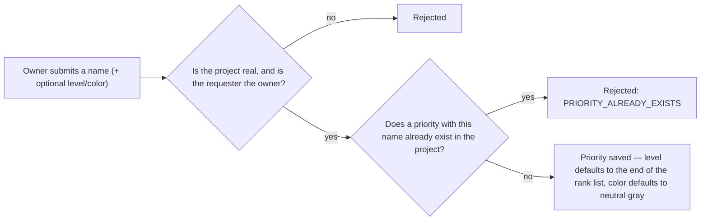
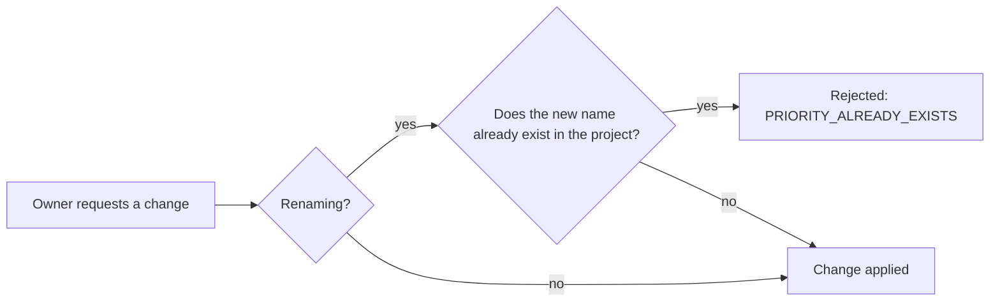

# Issue Priority — Overview

**Audience:** anyone — new contributors, product managers, or a developer returning to this
project after months away. No backend experience assumed.

**Purpose of this document:** explain _why_ the Issue Priority module exists and _what_ it does,
before any implementation detail. For how it's built, see [`architecture.md`](architecture.md).
For security specifics, see [`security.md`](security.md). For what's planned next, see
[`roadmap.md`](roadmap.md).

## Why does this exist?

Before this module, an issue's priority was a hardcoded value baked into the
[Issues](../issues/overview.md) schema (`low`, `medium`, `high`) — the same three values for every
project, forever. The Issue Priority module pulls that out into its own per-project lookup: a
project can have `Highest`, `High`, `Medium`, `Low`, `Lowest`, or any other named, ordered,
color-tagged set of priorities its owner defines, and an issue would reference one of those rows
instead of a fixed string.

This module intentionally does **one thing**: manage the list of priorities available to a
project. It does not decide which priority an issue should carry, does not enforce SLA or
escalation rules, and does not yet connect to the Issues module at all — that wiring, along with
SLA automation and permission-based priority management, is deliberately deferred (see
[`roadmap.md`](roadmap.md)) so this piece can ship as a small, well-tested foundation first.

## What can a user do?

| Action             | What it means for the user                                                 |
| ------------------ | -------------------------------------------------------------------------- |
| Create a priority  | Add a new named, ranked priority to a project                              |
| View a priority    | Read a single priority's details                                           |
| List priorities    | See every priority defined for a project, ranked from most to least urgent |
| Update a priority  | Rename it, change its rank, or change its color                            |
| Archive a priority | Retire it without deleting it — it stops being offered for new issues      |
| Restore a priority | Bring an archived priority back                                            |

There is no delete action. A priority can only be archived or restored — see
[Why there's no delete endpoint](security.md#no-delete-endpoint-only-archive-and-restore).

## What happens, in plain terms

### Creating a priority

Only a name is required. If `level` is omitted, the new priority is appended after the current
lowest-urgency level in that project, so creating priorities one at a time naturally builds a
ranked list without the client having to compute levels itself.

### Updating a priority

Uniqueness is only re-checked when the name is actually changing — updating just the level or
color never triggers a duplicate-name lookup.

### Archiving vs. restoring

There is no delete here, only these two states:

- **Archiving** retires a priority from active use without removing the row — any issue that still
  references it keeps working, but the priority stops being something a client would offer for new
  issues.
- **Restoring** is the only way back from archived; it fails if the priority isn't currently
  archived, mirroring the same rule the [Issue Status
  module](../issue-status/overview.md#archiving-vs-restoring) uses for restoring a status.

A priority keeps its id forever once created, because an issue may hold a reference to it that
must always resolve to something.

## Level, color, and the default set

| Field   | Values                   | Default                                             |
| ------- | ------------------------ | --------------------------------------------------- |
| `level` | any non-negative integer | one past the project's current lowest-urgency level |
| `color` | a `#RRGGBB` hex code     | `#6B7280` (neutral gray)                            |

`level` ranks priorities within a project — a **lower** number means a **more urgent** priority.
`color` exists purely for a future UI to tag a priority visually; the module doesn't interpret it
beyond validating its shape. `DEFAULT_PRIORITIES` (`Highest`, `High`, `Medium`, `Low`, `Lowest`,
with sensible levels and colors already assigned) is defined as a constant for a future "seed
every new project with these" integration — see [`roadmap.md`](roadmap.md) for why that wiring
isn't part of this module yet.

## Why these particular design choices?

| Choice                                                | Why                                                                                                                                                           |
| ----------------------------------------------------- | ------------------------------------------------------------------------------------------------------------------------------------------------------------- |
| Only the project owner can write, any member can read | Priorities define a shared vocabulary for the whole project — a looser, per-member write model (like Issues has) would let any member reshape it for everyone |
| Name unique per project, not globally                 | Two different projects should both be free to have a "High" priority without colliding                                                                        |
| Archive instead of delete                             | Issues may reference a priority id; deleting the row out from under them would leave a dangling reference                                                     |
| Level auto-increments on create                       | Lets a client create priorities one at a time and get a sensible rank for free, without computing levels itself                                               |
| No SLA/escalation logic in this module                | Keeps the surface area small and testable; SLA and escalation rules are a distinct concern layered on top later — see [`roadmap.md`](roadmap.md)              |

## Where to go next

- **Building or reviewing a feature in this area?** → [`architecture.md`](architecture.md)
- **Evaluating or auditing security posture?** → [`security.md`](security.md)
- **Planning what comes after this?** → [`roadmap.md`](roadmap.md)
- **Working directly in the code?** → [`src/modules/issue-priority/README.md`](../../src/modules/issue-priority/README.md)
