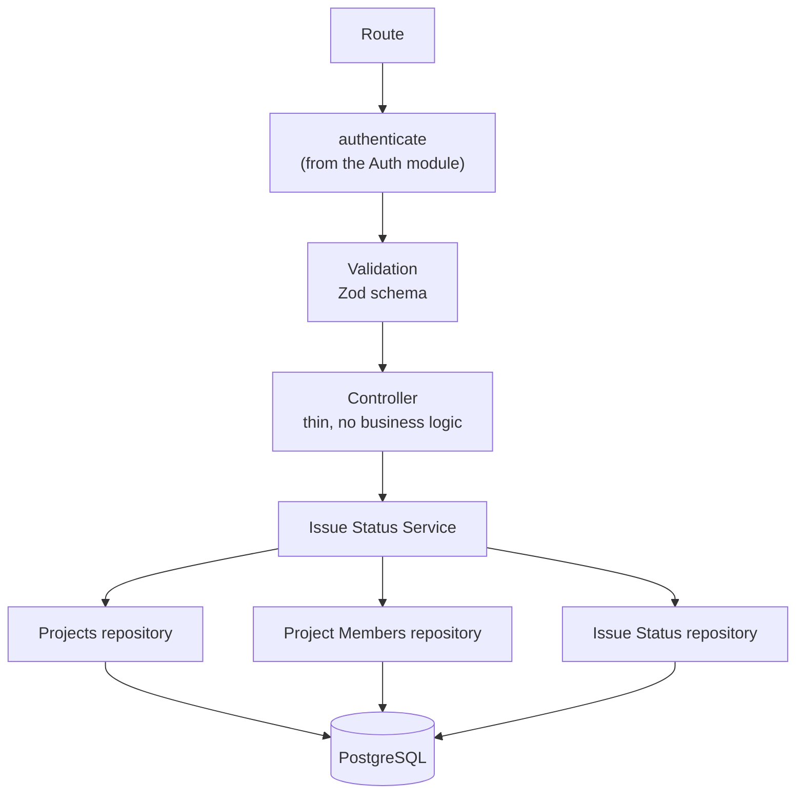
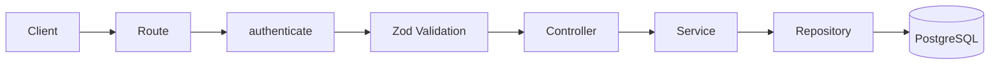
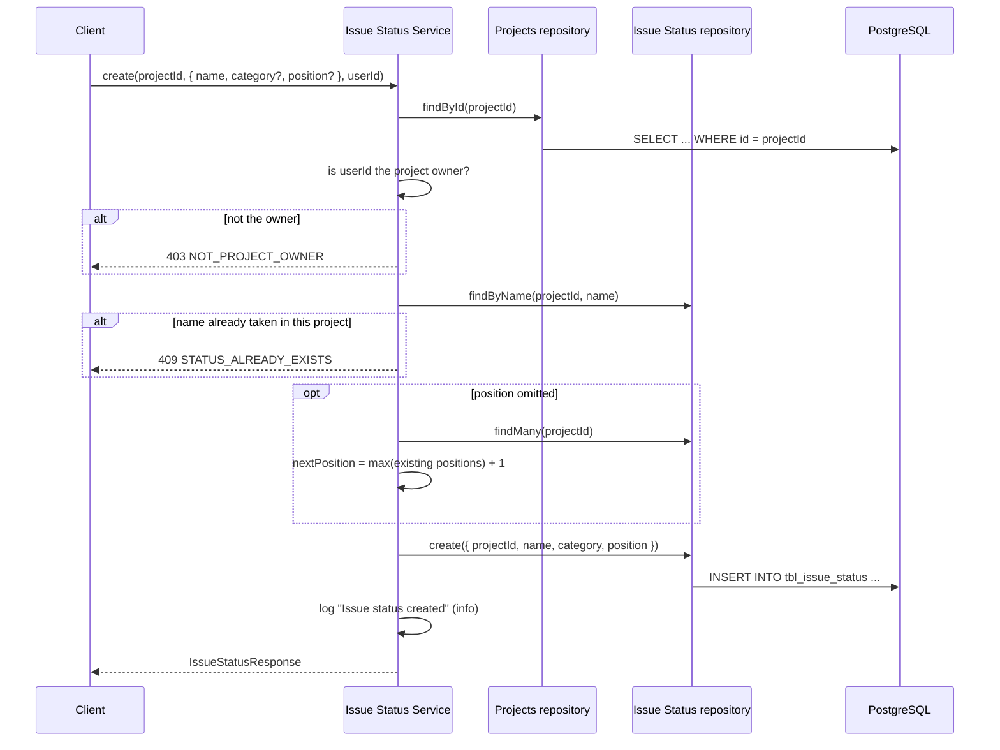
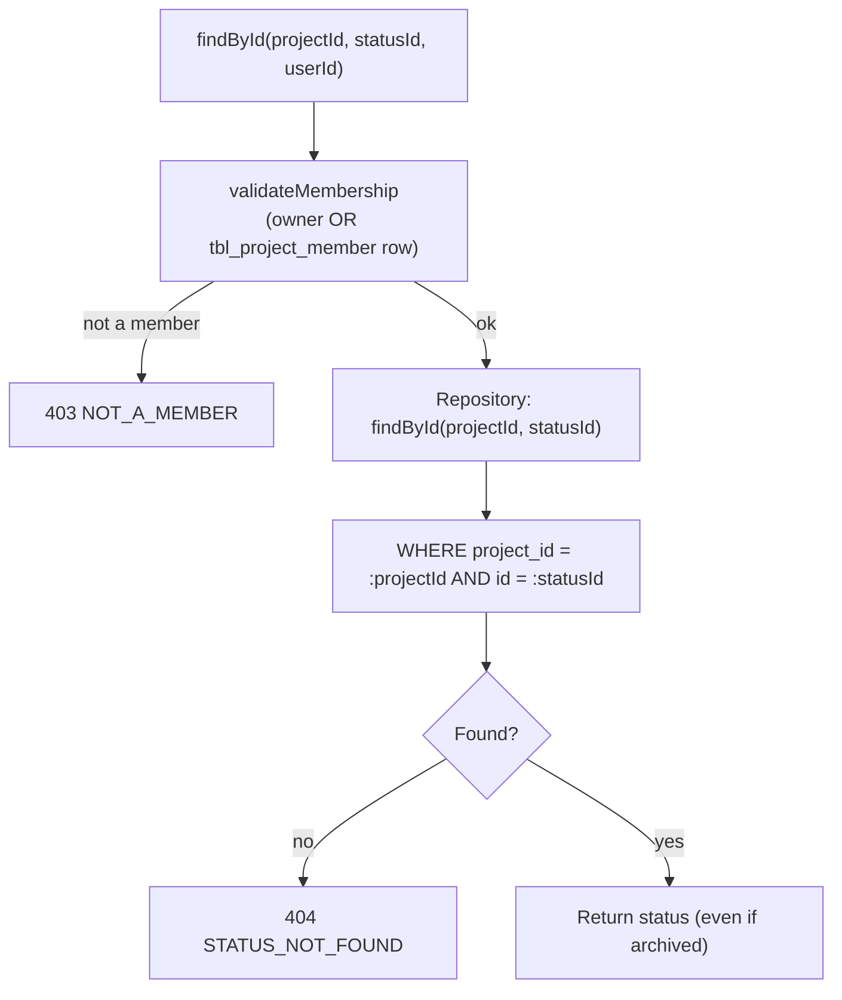
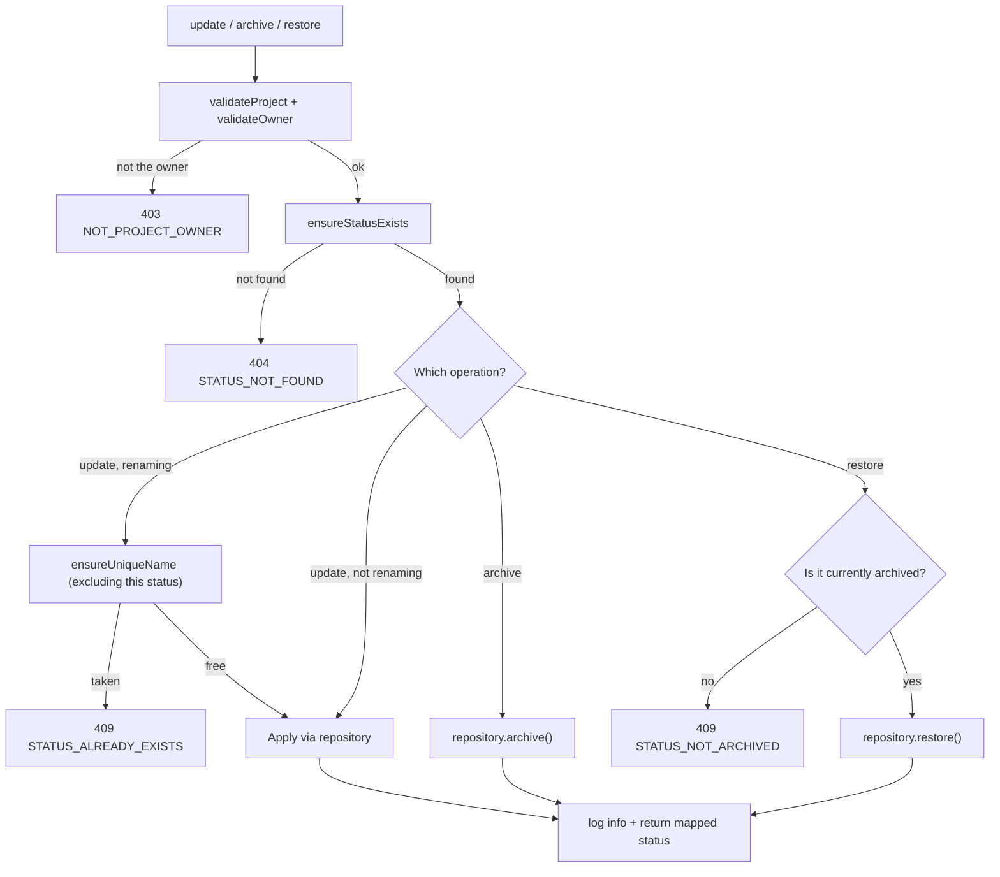

# Issue Status — Architecture

**Audience:** developers and contributors who want to understand how the system fits together
before reading code. Read [`overview.md`](overview.md) first if you haven't — this document
assumes you already know _why_ the system works this way and focuses on _how_.

## Layered design

The module follows the same layering as [Issues](../issues/architecture.md), reaching into the
Projects and Project Members repositories directly, the same way Issues does:

| Layer      | Job                                                                                     | Must NOT do                                                        |
| ---------- | --------------------------------------------------------------------------------------- | ------------------------------------------------------------------ |
| Route      | Wire `authenticate` + Zod schema + controller together                                  | Contain logic                                                      |
| Controller | Read `req`, call one service method, send a response                                    | Talk to the database, know about ownership or membership           |
| Service    | Validate project/owner/membership, enforce unique-name and restore rules, map responses | Know about `req`/`res`                                             |
| Repository | Run Drizzle queries against `tbl_issue_status`, never filtering archived rows           | Throw HTTP errors, know about ownership, membership, or uniqueness |

The repository's refusal to filter `archived` rows is deliberate: `findById` and `findMany` must
keep returning archived statuses, or `restore()` would have no way to locate the row it's supposed
to bring back. Every "should this be hidden" decision lives in the service, never the repository.

## Request flow

`GET /` (list) takes no query parameters — unlike Issues' `findAll`, there's no filtering or
pagination here, since a project's status list is expected to stay small (a handful of workflow
states, not thousands of rows).

## Create flow

`validateProject` is called once and its `ProjectRow` result is passed directly into
`validateOwner`, so create/update/archive/restore never fetch the same project twice the way an
earlier draft of the service did.

## Read flow (`findById`, `findAll`)

This is the one place the module's authorization deliberately splits from its own write path:
reads use `validateMembership` (owner or member), writes use `validateOwner` (owner only) — see
[`security.md`](security.md#membership-for-reads-ownership-for-writes) for why.

## Update / archive / restore flow

Archiving does not check whether the status is already archived — an already-archived status can
be archived again without error (idempotent), the same as [Issues' archive
flow](../issues/architecture.md#archive--restore-flow). Restoring is the mirror image: it
explicitly requires the status to already be archived.

## Position assignment

`nextPosition` (private, in the service) loads every status in the project via
`issueStatusRepository.findMany` and takes `max(position) + 1`, defaulting to `1` for a project's
first status. This only runs when `position` is omitted from the create payload — an explicit
`position` value is used as-is, with no re-numbering of other statuses. Reordering an existing
status therefore currently means an explicit `PATCH` with a new `position`; there is no dedicated
"reorder" endpoint yet (see [`roadmap.md`](roadmap.md)).

## Logging architecture

Like [Issues](../issues/architecture.md#logging-architecture), this module uses the shared Pino
`logger` directly rather than the queue-ready `AuditLogger`:

| Level   | When                                                                                            |
| ------- | ----------------------------------------------------------------------------------------------- |
| `info`  | A mutation succeeded: created, updated, archived, restored                                      |
| `warn`  | A request was rejected: not found, not owner, not a member, name conflict, restore-not-archived |
| `debug` | A read succeeded (single status or list)                                                        |

Every log line includes `projectId`, `statusId` (where applicable), and `userId`.

## See also

- [`overview.md`](overview.md) — why this system exists, in plain language
- [`security.md`](security.md) — each control and why it exists
- [`roadmap.md`](roadmap.md) — what's planned and how this design accommodates it
- [`src/modules/issue-status/README.md`](../../src/modules/issue-status/README.md) — file-by-file implementation reference
