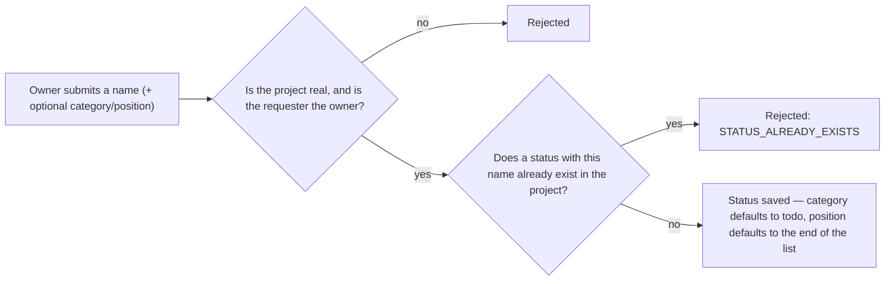
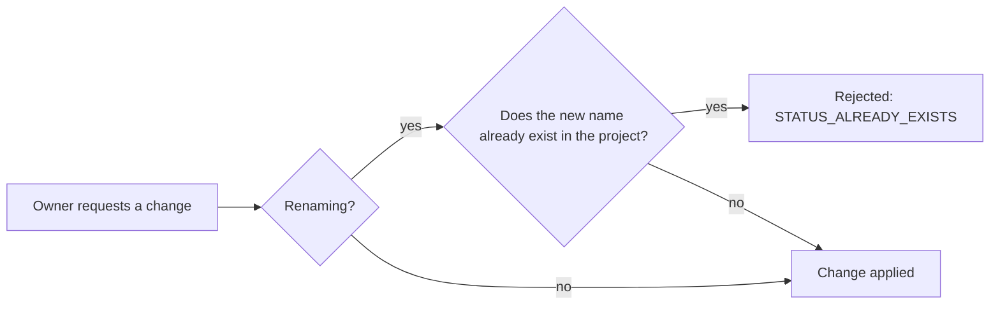

# Issue Status — Overview

**Audience:** anyone — new contributors, product managers, or a developer returning to this
project after months away. No backend experience assumed.

**Purpose of this document:** explain _why_ the Issue Status module exists and _what_ it does,
before any implementation detail. For how it's built, see [`architecture.md`](architecture.md).
For security specifics, see [`security.md`](security.md). For what's planned next, see
[`roadmap.md`](roadmap.md).

## Why does this exist?

Before this module, an issue's status was going to be a hardcoded value baked into the
[Issues](../issues/overview.md) schema (`todo`, `in-progress`, `done`) — the same three values for
every project, forever. The Issue Status module pulls that out into its own per-project lookup: a
project can have `Todo`, `In Progress`, `Review`, `Done`, or any other set of named states its
owner defines, and an issue would reference one of those rows instead of a fixed string.

This module intentionally does **one thing**: manage the list of states available to a project. It
does not decide which state an issue transitions to next, does not enforce transition rules, and
does not yet connect to the Issues module at all — that wiring, along with workflow transitions and
permission-based transitions, is deliberately deferred (see [`roadmap.md`](roadmap.md)) so this
piece can ship as a small, well-tested foundation first.

## What can a user do?

| Action           | What it means for the user                                            |
| ---------------- | --------------------------------------------------------------------- |
| Create a status  | Add a new named state to a project's workflow                         |
| View a status    | Read a single status's details                                        |
| List statuses    | See every status defined for a project, in display order              |
| Update a status  | Rename it, change its category, or move it to a new position          |
| Archive a status | Retire it without deleting it — it stops being offered for new issues |
| Restore a status | Bring an archived status back                                         |

There is no delete action. A status can only be archived or restored — see
[Why there's no delete endpoint](security.md#no-delete-endpoint-only-archive-and-restore).

## What happens, in plain terms

### Creating a status

Only a name is required. If `position` is omitted, the new status is appended after the current
highest position in that project, so creating statuses one at a time naturally builds an ordered
list without the client having to compute positions itself.

### Updating a status

Uniqueness is only re-checked when the name is actually changing — updating just the category or
position never triggers a duplicate-name lookup.

### Archiving vs. restoring

There is no delete here, only these two states:

- **Archiving** retires a status from active use without removing the row — any issue that still
  references it keeps working, but the status stops being something a client would offer for new
  issues.
- **Restoring** is the only way back from archived; it fails if the status isn't currently
  archived, mirroring the same rule the [Issues module](../issues/overview.md#archiving-vs-restoring-vs-deleting)
  uses for restoring an issue.

Unlike Issues, there's no soft-delete concept here at all — a status keeps its id forever once
created, because an issue may hold a reference to it that must always resolve to something.

## Categories, position, and the default set

| Field      | Values                        | Default                            |
| ---------- | ----------------------------- | ---------------------------------- |
| `category` | `todo`, `in-progress`, `done` | `todo`                             |
| `position` | any non-negative integer      | one past the project's current max |

`category` groups statuses into the three coarse workflow stages a future board/kanban view would
use for swimlanes; `position` controls display order within a project. `DEFAULT_STATUSES` (`Todo`,
`In Progress`, `Review`, `Done`) is defined as a constant for a future "seed every new project with
these" integration — see [`roadmap.md`](roadmap.md) for why that wiring isn't part of this module
yet.

## Why these particular design choices?

| Choice                                                | Why                                                                                                                                                               |
| ----------------------------------------------------- | ----------------------------------------------------------------------------------------------------------------------------------------------------------------- |
| Only the project owner can write, any member can read | Statuses define the shape of the workflow for the whole project — a looser, per-member write model (like Issues has) would let any member reshape it for everyone |
| Name unique per project, not globally                 | Two different projects should both be free to have a "Todo" status without colliding                                                                              |
| Archive instead of delete                             | Issues may reference a status id; deleting the row out from under them would leave a dangling reference                                                           |
| Position auto-increments on create                    | Lets a client create statuses one at a time and get a sensible order for free, without computing positions itself                                                 |
| No workflow/transition logic in this module           | Keeps the surface area small and testable; transitions are a distinct concern layered on top later — see [`roadmap.md`](roadmap.md)                               |

## Where to go next

- **Building or reviewing a feature in this area?** → [`architecture.md`](architecture.md)
- **Evaluating or auditing security posture?** → [`security.md`](security.md)
- **Planning what comes after this?** → [`roadmap.md`](roadmap.md)
- **Working directly in the code?** → [`src/modules/issue-status/README.md`](../../src/modules/issue-status/README.md)
