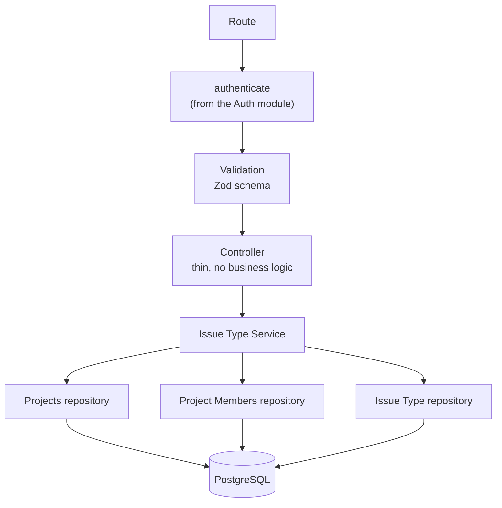
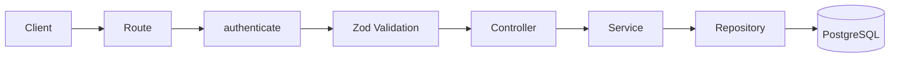
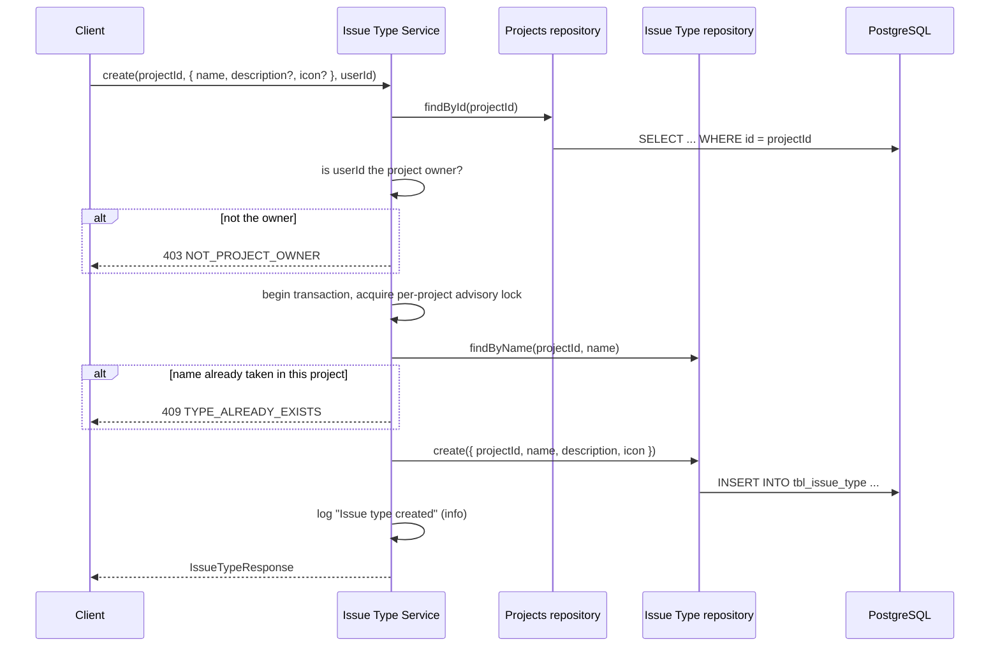
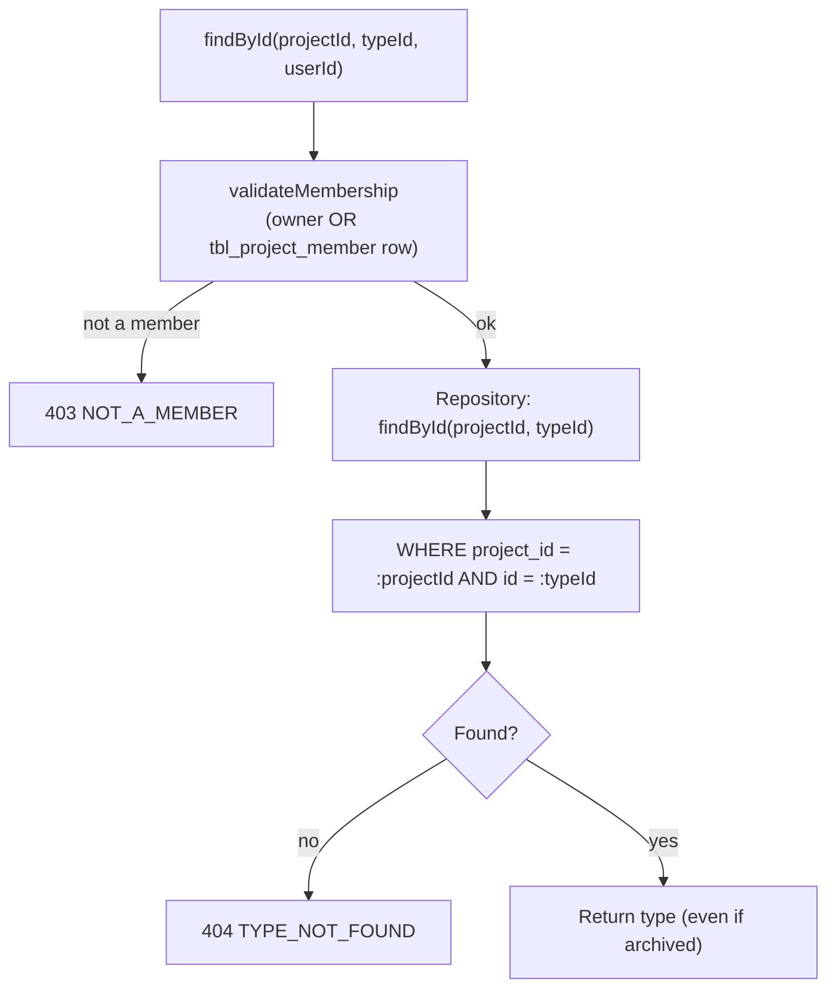
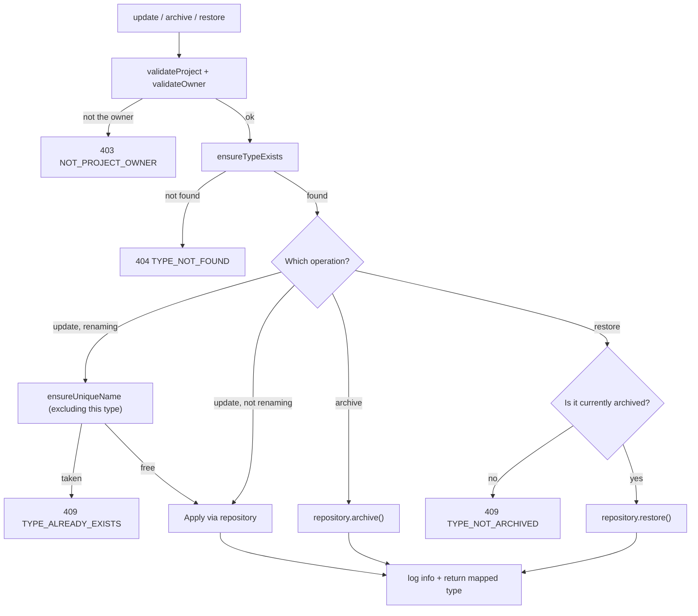

# Issue Type — Architecture

**Audience:** developers and contributors who want to understand how the system fits together
before reading code. Read [`overview.md`](overview.md) first if you haven't — this document
assumes you already know _why_ the system works this way and focuses on _how_.

## Layered design

The module follows the same layering as [Issue Priority](../issue-priority/architecture.md),
reaching into the Projects and Project Members repositories directly, the same way Issue Priority
does:

| Layer      | Job                                                                                     | Must NOT do                                                        |
| ---------- | --------------------------------------------------------------------------------------- | ------------------------------------------------------------------ |
| Route      | Wire `authenticate` + Zod schema + controller together                                  | Contain logic                                                      |
| Controller | Read `req`, call one service method, send a response                                    | Talk to the database, know about ownership or membership           |
| Service    | Validate project/owner/membership, enforce unique-name and restore rules, map responses | Know about `req`/`res`                                             |
| Repository | Run Drizzle queries against `tbl_issue_type`, never filtering archived rows             | Throw HTTP errors, know about ownership, membership, or uniqueness |

The repository's refusal to filter `archived` rows is deliberate: `findById` and `findMany` must
keep returning archived types, or `restore()` would have no way to locate the row it's supposed to
bring back. Every "should this be hidden" decision lives in the service, never the repository.

## Request flow

`GET /` (list) takes no query parameters — a project's type list is expected to stay small (a
handful of categories, not thousands of rows), so there's no filtering or pagination here.

## Create flow

`validateProject` is called once and its `ProjectRow` result is passed directly into
`validateOwner`, so create/update/archive/restore never fetch the same project twice.

## Read flow (`findById`, `findAll`)

This is the one place the module's authorization deliberately splits from its own write path:
reads use `validateMembership` (owner or member), writes use `validateOwner` (owner only) — see
[`security.md`](security.md#membership-for-reads-ownership-for-writes) for why.

## Update / archive / restore flow

Archiving does not check whether the type is already archived — an already-archived type can be
archived again without error (idempotent). Restoring is the mirror image: it explicitly requires
the type to already be archived.

## Locking

Unlike [Issue Status](../issue-status/architecture.md) and [Issue
Priority](../issue-priority/architecture.md), this module has no ordering field (no `position` or
`level`) to assign on create — a type's identity is just its name, description, and icon. Create
and rename still run inside `runLocked`, which opens a transaction, takes a Postgres advisory lock
scoped to the project id (`pg_advisory_xact_lock(hashtext(projectId))`), and only then performs the
uniqueness check and the write. This closes the race where two concurrent requests for the same
name could both pass the `findByName` check before either commits — without the lock, the
database's `unique(project_id, name)` constraint would still catch it, but as a raw constraint
violation instead of a clean `409`. `runLocked` translates that unique-violation (Postgres error
code `23505`) into the same `TYPE_ALREADY_EXISTS` error the pre-check throws, so callers see one
consistent error path either way.

## Logging architecture

Like [Issue Priority](../issue-priority/architecture.md#logging-architecture), this module uses
the shared Pino `logger` directly rather than the queue-ready `AuditLogger`:

| Level   | When                                                                                            |
| ------- | ----------------------------------------------------------------------------------------------- |
| `info`  | A mutation succeeded: created, updated, archived, restored                                      |
| `warn`  | A request was rejected: not found, not owner, not a member, name conflict, restore-not-archived |
| `debug` | A read succeeded (single type or list)                                                          |

Every log line includes `projectId`, `typeId` (where applicable), and `userId`.

## See also

- [`overview.md`](overview.md) — why this system exists, in plain language
- [`security.md`](security.md) — each control and why it exists
- [`roadmap.md`](roadmap.md) — what's planned and how this design accommodates it
- [`src/modules/issue-type/README.md`](../../src/modules/issue-type/README.md) — file-by-file implementation reference
