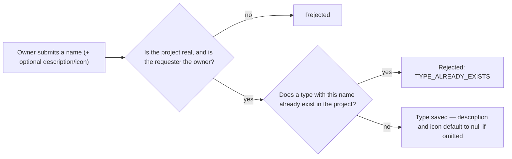
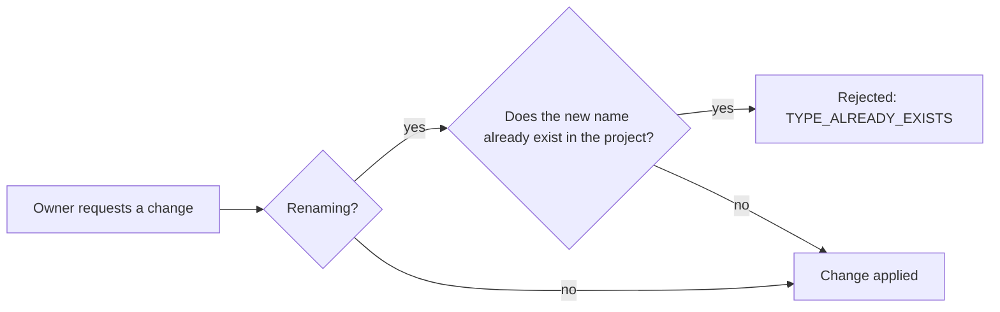

# Issue Type — Overview

**Audience:** anyone — new contributors, product managers, or a developer returning to this
project after months away. No backend experience assumed.

**Purpose of this document:** explain _why_ the Issue Type module exists and _what_ it does,
before any implementation detail. For how it's built, see [`architecture.md`](architecture.md).
For security specifics, see [`security.md`](security.md). For what's planned next, see
[`roadmap.md`](roadmap.md).

## Why does this exist?

Before this module, an issue's type was a hardcoded value baked into the
[Issues](../issues/overview.md) schema (`task`, `bug-fix`) — the same two values for every
project, forever. The Issue Type module pulls that out into its own per-project lookup: a project
can have `Task`, `Bug`, `Story`, `Epic`, `Spike`, `Improvement`, or any other named type its owner
defines, and an issue would reference one of those rows instead of a fixed string.

This module intentionally does **one thing**: manage the list of types available to a project. It
does not model issue type hierarchies, does not group types into schemes, and does not yet connect
to the Issues module at all — that wiring, along with screen schemes and organization-wide
templates, is deliberately deferred (see [`roadmap.md`](roadmap.md)) so this piece can ship as a
small, well-tested foundation first.

## What can a user do?

| Action         | What it means for the user                                            |
| -------------- | --------------------------------------------------------------------- |
| Create a type  | Add a new named type to a project                                     |
| View a type    | Read a single type's details                                          |
| List types     | See every type defined for a project                                  |
| Update a type  | Rename it, or change its description or icon                          |
| Archive a type | Retire it without deleting it — it stops being offered for new issues |
| Restore a type | Bring an archived type back                                           |

There is no delete action. A type can only be archived or restored — see
[Why there's no delete endpoint](security.md#no-delete-endpoint-only-archive-and-restore).

## What happens, in plain terms

### Creating a type

Only a name is required. `description` and `icon` are both optional free-text fields with no
default value.

### Updating a type

Uniqueness is only re-checked when the name is actually changing — updating just the description
or icon never triggers a duplicate-name lookup.

### Archiving vs. restoring

There is no delete here, only these two states:

- **Archiving** retires a type from active use without removing the row — any issue that still
  references it keeps working, but the type stops being something a client would offer for new
  issues.
- **Restoring** is the only way back from archived; it fails if the type isn't currently archived,
  mirroring the same rule the [Issue Priority
  module](../issue-priority/overview.md#archiving-vs-restoring) uses for restoring a priority.

A type keeps its id forever once created, because an issue may hold a reference to it that must
always resolve to something.

## Description, icon, and the default set

| Field         | Values    | Default |
| ------------- | --------- | ------- |
| `description` | free text | `null`  |
| `icon`        | free text | `null`  |

Neither field is interpreted by this module — they exist so a future UI can label and visually tag
a type. `DEFAULT_TYPES` (`Task`, `Bug`, `Story`, `Epic`, `Spike`, `Improvement`, each with a
sensible description and icon already assigned) is defined as a constant for a future "seed every
new project with these" integration — see [`roadmap.md`](roadmap.md) for why that wiring isn't
part of this module yet.

## Why these particular design choices?

| Choice                                                | Why                                                                                                                                                      |
| ----------------------------------------------------- | -------------------------------------------------------------------------------------------------------------------------------------------------------- |
| Only the project owner can write, any member can read | Types define a shared vocabulary for the whole project — a looser, per-member write model (like Issues has) would let any member reshape it for everyone |
| Name unique per project, not globally                 | Two different projects should both be free to have a "Bug" type without colliding                                                                        |
| Archive instead of delete                             | Issues may reference a type id; deleting the row out from under them would leave a dangling reference                                                    |
| No hierarchy or scheme logic in this module           | Keeps the surface area small and testable; hierarchies and schemes are a distinct concern layered on top later — see [`roadmap.md`](roadmap.md)          |

## Where to go next

- **Building or reviewing a feature in this area?** → [`architecture.md`](architecture.md)
- **Evaluating or auditing security posture?** → [`security.md`](security.md)
- **Planning what comes after this?** → [`roadmap.md`](roadmap.md)
- **Working directly in the code?** → [`src/modules/issue-type/README.md`](../../src/modules/issue-type/README.md)
