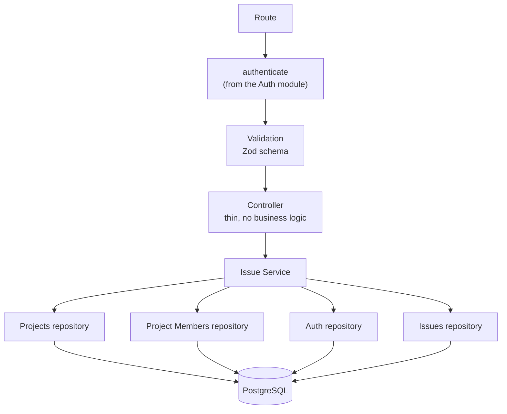
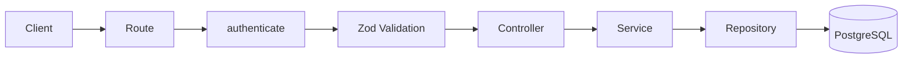
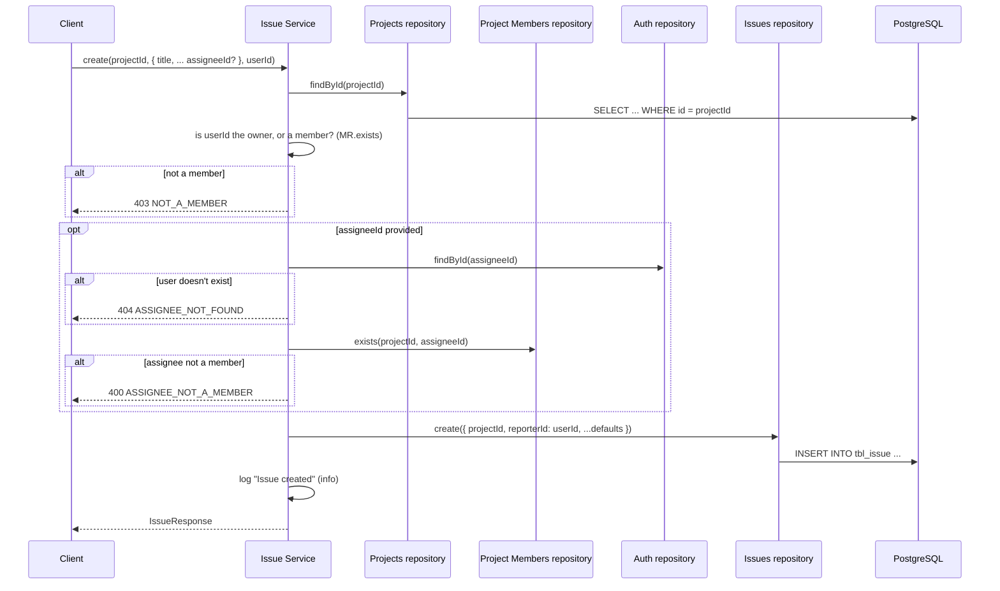
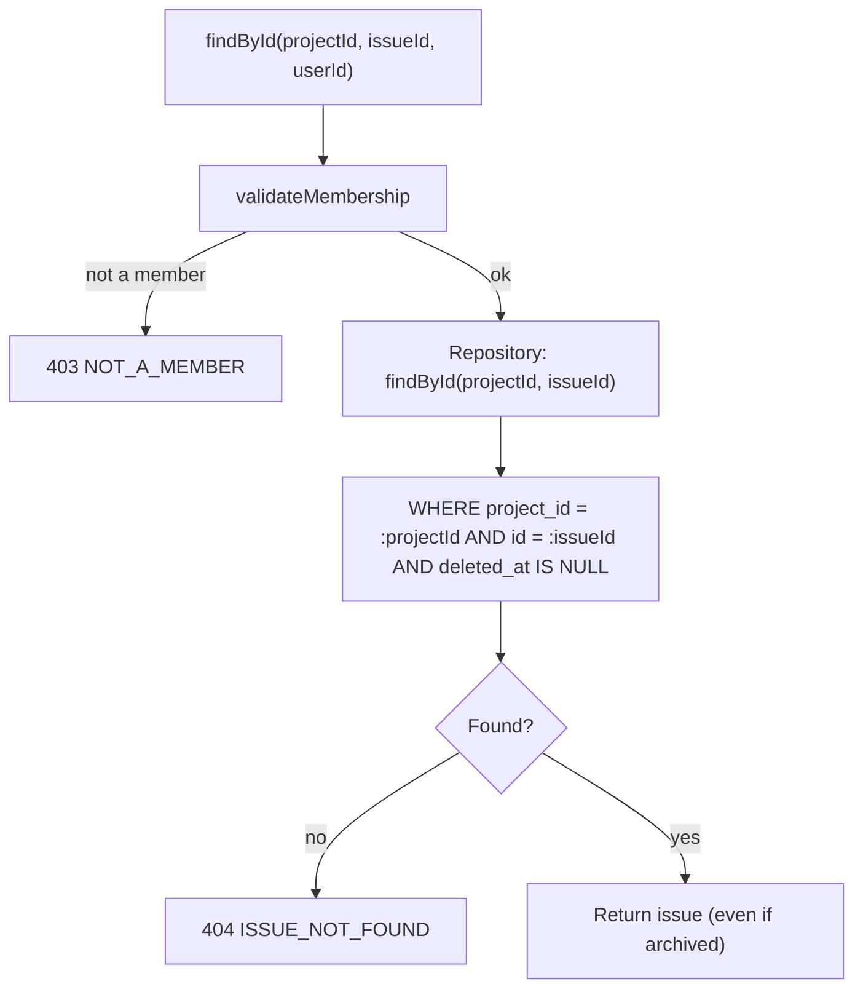
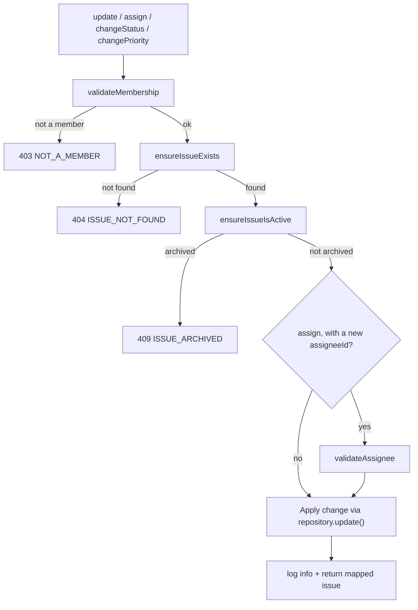
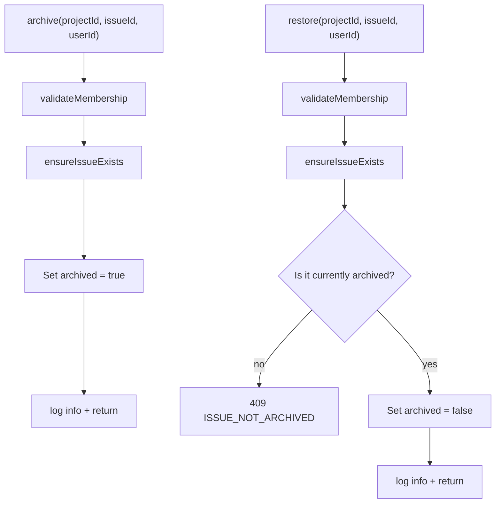
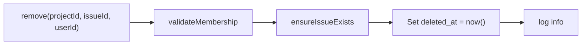

# Issues — Architecture

**Audience:** developers and contributors who want to understand how the system fits together
before reading code. Read [`overview.md`](overview.md) first if you haven't — this document
assumes you already know _why_ the system works this way and focuses on _how_.

## Layered design

The module follows the same layering as [Projects](../projects/architecture.md) and
[Project Members](../project-members/architecture.md), but is the first module that reaches into
two other domain modules' repositories directly, rather than just Auth's:

| Layer      | Job                                                                                     | Must NOT do                                           |
| ---------- | --------------------------------------------------------------------------------------- | ----------------------------------------------------- |
| Route      | Wire `authenticate` + Zod schema + controller together                                  | Contain logic                                         |
| Controller | Read `req`, call one service method, send a response                                    | Talk to the database, know about membership rules     |
| Service    | Validate project/membership/assignee, enforce archived/soft-delete rules, map responses | Know about `req`/`res`                                |
| Repository | Run Drizzle queries against `tbl_issue`, always excluding soft-deleted rows             | Throw HTTP errors, know about membership or archiving |

This is why the archived-issue check, the assignee-membership check, and the "restore requires
archived" rule all live entirely in `issue.service.ts` and never touch the controller, routes, or
repository.

## Request flow

One route — `GET /` (list) — validates `query`, not just `body`/`params`. Building it surfaced a
real Express 5 issue: `req.query` has no setter in this version, so the shared `validate`
middleware originally could not overwrite it with parsed/coerced values (page/limit as numbers,
`archived` as a boolean). The fix merges the parsed result into the existing `req.query` object in
place (`Object.assign`) instead of reassigning it — see `src/lib/validators/validate.ts`. This is
shared infrastructure, so any future module adding query validation benefits from it too.

## Create flow

`validateMembership` is called once and its `ProjectRow` result is threaded into
`validateAssignee`, so a create or assign call never fetches the same project twice.

## Read flow (`findById`, `findAll`)

Soft-deleted rows are filtered out at the repository level for every read — the service never sees
them, so a deleted issue and a nonexistent one are indistinguishable from the outside, both
`404 ISSUE_NOT_FOUND`. Archived issues are **not** filtered out here; they remain fully readable,
only their mutation paths are blocked (see below).

`findAll` runs the same membership check, then asks the repository for a filtered, paginated page
(`status`, `priority`, `type`, `assigneeId`, `archived`, `page`, `limit`) plus a total count,
executed as two queries in parallel.

## Update / assign / status / priority flow

All four operations share this exact shape; they differ only in which fields they pass to
`issueRepository.update()`.

## Archive / restore flow

Archiving does not call `ensureIssueIsActive` — an already-archived issue can be archived again
without error (idempotent). Restoring is the mirror image: it explicitly requires the issue to
already be archived, so it can't be used as a no-op "activate" on an issue that was never archived.

## Remove flow (soft delete)

There is no `ensureIssueIsActive` check here either — an archived issue can still be deleted. The
repository never physically removes a row; `softDelete` only stamps `deleted_at`, which every read
query then filters on.

## Logging architecture

Like [Projects](../projects/architecture.md#logging-architecture) and unlike Auth's queue-ready
`AuditLogger`, Issues uses the shared Pino `logger` directly for operational visibility:

| Level   | When                                                                                                   |
| ------- | ------------------------------------------------------------------------------------------------------ |
| `info`  | A mutation succeeded: created, updated, assigned, status/priority changed, archived, restored, deleted |
| `warn`  | A request was rejected: not found, not a member, archived-conflict, assignee invalid                   |
| `debug` | A read succeeded (single issue or list)                                                                |

Every log line includes `projectId`, `issueId` (where applicable), and `userId` so behavior can be
traced from logs alone — see [`security.md`](security.md#operational-logging) for what's
deliberately excluded.

## See also

- [`overview.md`](overview.md) — why this system exists, in plain language
- [`security.md`](security.md) — each control and why it exists
- [`roadmap.md`](roadmap.md) — what's planned and how this design accommodates it
- [`src/modules/issues/README.md`](../../src/modules/issues/README.md) — file-by-file implementation reference
