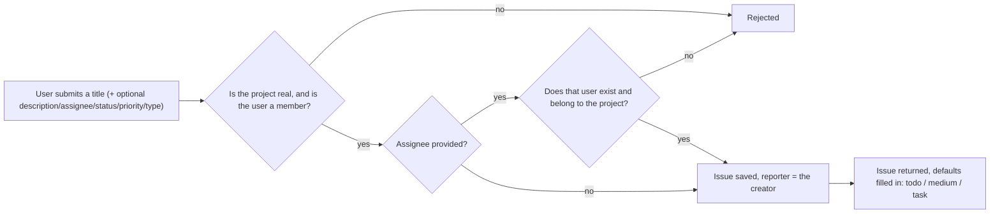
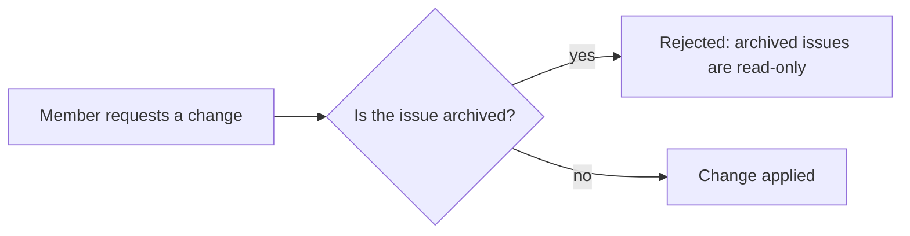

# Issues — Overview

**Audience:** anyone — new contributors, product managers, or a developer returning to this
project after months away. No backend experience assumed.

**Purpose of this document:** explain _why_ the Issues module exists and _what_ it does, before
any implementation detail. For how it's built, see [`architecture.md`](architecture.md). For
security specifics, see [`security.md`](security.md). For what's planned next, see
[`roadmap.md`](roadmap.md).

## Why does this exist?

A project on its own is just a container. The work that actually happens inside it — a bug to fix,
a task to complete, a feature to build — is an **issue**. The Issues module is the core aggregate
of the whole platform: it's what [Projects](../projects/overview.md) and
[Project Members](../project-members/overview.md) exist to support, and it's what every future
module (comments, labels, attachments, watchers, sprints) will attach itself to.

## What can a user do?

| Action           | What it means for the user                                            |
| ---------------- | --------------------------------------------------------------------- |
| Create an issue  | Report a task or bug against a project they belong to                 |
| View an issue    | Read a single issue's details                                         |
| List issues      | Browse a project's issues, optionally filtered by status/priority/etc |
| Update an issue  | Change its title, description, or type                                |
| Assign an issue  | Hand it to a project member, or unassign it                           |
| Change status    | Move it through `todo` → `in-progress` → `done`                       |
| Change priority  | Mark it `low`, `medium`, or `high`                                    |
| Archive an issue | Freeze it — no further changes, but still visible                     |
| Restore an issue | Bring an archived issue back to an editable state                     |
| Delete an issue  | Remove it from view (recoverable at the data layer, not via the API)  |

## What happens, in plain terms

### Creating an issue

The reporter is never a field the client fills in — it's always the authenticated user making the
request. A title alone is enough to create an issue; everything else has a sensible default.

### Assigning an issue

Assignment is deliberately a two-part check: the person being assigned must **exist**, and they
must already **belong to the project** the issue is in. Assigning a random valid user id who has
never joined the project is rejected just as firmly as assigning an id that doesn't exist at all —
see [Why assignment has two failure modes](security.md#assignment-has-two-distinct-failure-modes)
for the reasoning. Sending no assignee (`null`) unassigns the issue.

### Changing an issue

This applies uniformly to updates, assignment, status changes, and priority changes — archiving an
issue means exactly one thing everywhere: nothing about it changes until it's restored.

### Archiving vs. restoring vs. deleting

These solve three different problems, mirroring the same distinction
[Projects](../projects/overview.md#archiving-vs-deleting) draws at the project level:

- **Archiving** freezes an issue without hiding it — useful for work that's done but still worth
  keeping visible for reference.
- **Restoring** is the only way back from archived; it fails if the issue isn't currently archived,
  so it can't be used to silently no-op on an already-active issue.
- **Deleting** is a soft delete — the issue stops appearing anywhere in the API (list, get, or
  otherwise) but the row isn't physically removed, leaving room for a future "trash/undo" feature
  without a schema change.

## Status, priority, and type

| Field    | Values                        | Default  |
| -------- | ----------------------------- | -------- |
| status   | `todo`, `in-progress`, `done` | `todo`   |
| priority | `low`, `medium`, `high`       | `medium` |
| type     | `task`, `bug-fix`             | `task`   |

Status and priority each get their own endpoint (`/status`, `/priority`) rather than being folded
into the general update endpoint — see [`architecture.md`](architecture.md) for why that separation
exists.

## Why these particular design choices?

| Choice                                                   | Why                                                                                                                                                        |
| -------------------------------------------------------- | ---------------------------------------------------------------------------------------------------------------------------------------------------------- |
| Any project member can act on any issue                  | Keeps the first version shippable and simple; a Permissions module can later restrict this without changing the API shape — see [`roadmap.md`](roadmap.md) |
| Assignee must be a project member                        | An issue assigned to someone with no access to the project would be a dead end for that person                                                             |
| Dedicated status/priority endpoints                      | These change far more often than title/description and benefit from a narrower, purpose-built request shape                                                |
| Archive is reversible, delete is soft                    | Neither operation destroys data, so mistakes and future "undo" features stay possible without a redesign                                                   |
| Reporter always the authenticated user                   | Prevents a client from fabricating "who reported this" on someone else's behalf                                                                            |
| Depends on Projects and Project Members, not the reverse | Keeps the dependency direction one-way: Issues can know about projects and membership, but Projects and Project Members know nothing about Issues          |

## Where to go next

- **Building or reviewing a feature in this area?** → [`architecture.md`](architecture.md)
- **Evaluating or auditing security posture?** → [`security.md`](security.md)
- **Planning what comes after this?** → [`roadmap.md`](roadmap.md)
- **Working directly in the code?** → [`src/modules/issues/README.md`](../../src/modules/issues/README.md)
