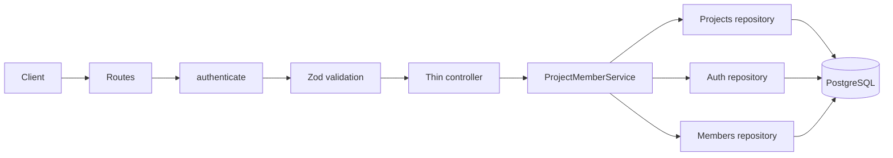
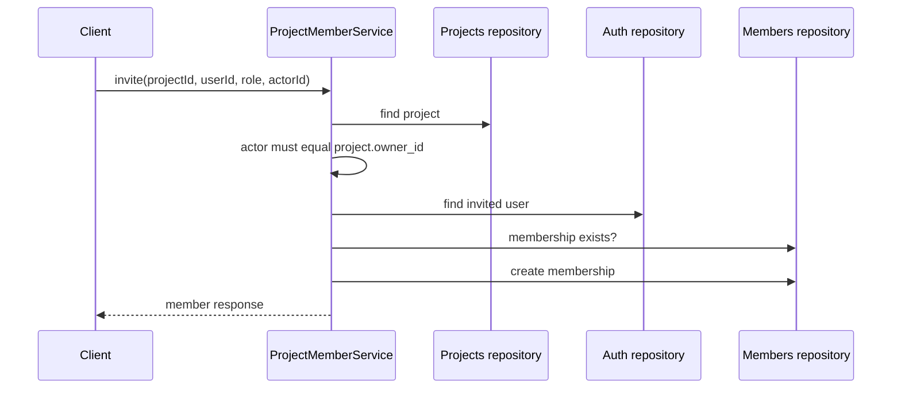

# Project Members — Architecture

**Audience:** contributors implementing or reviewing membership behavior. Read
[`overview.md`](overview.md) first for the product-level model.

## Layered design

| Layer      | Responsibility                                           | Must not do                                |
| ---------- | -------------------------------------------------------- | ------------------------------------------ |
| Routes     | Mount authentication, validation, and controller         | Make authorization decisions               |
| Controller | Read request values and return shared responses          | Query data or catch errors                 |
| Service    | Enforce ownership, duplicate, and owner-protection rules | Depend on Express objects                  |
| Repository | Execute Drizzle persistence queries                      | Apply business rules or return HTTP errors |
| Schemas    | Validate UUIDs and the role allow-list                   | Perform database reads                     |

## Data model

`tbl_project_member` contains a UUID id, non-null foreign keys to `tbl_project` and `tbl_user`, a
`project_member_roles` enum value, and `created_at`. Its composite unique constraint on
`(project_id, user_id)` is the final guard against duplicate memberships. Individual indexes on
project id, user id, and role support expected list and filter access patterns.

The service first checks for an existing membership for a friendly conflict response. It also maps
PostgreSQL's unique-constraint error (`23505`) to the same `MEMBER_ALREADY_EXISTS` response so
concurrent invite requests cannot become an accidental 500.

## Request flows

### Invite

Updates and removals use the same owner check, then load the membership by id and confirm that it
belongs to the path's project. This prevents a valid member id from one project being used against
another project URL.

## Response mapping and logging

The service maps snake_case database records to the API's camelCase response shape; controllers do
not transform records. Successful invitations, role changes, removals, and lists are structured
logs. Rejected ownership checks, missing resources, duplicates, and attempts to alter/remove an
owner are warning logs. Log fields contain identifiers and outcomes, never a full request body.

## See also

- [`overview.md`](overview.md)
- [`security.md`](security.md)
- [`src/modules/project-members/project-member.service.ts`](../../src/modules/project-members/project-member.service.ts)
