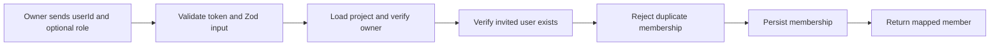

# Project Members — Overview

**Audience:** anyone who needs to understand collaboration within a Kaizen project before reading
implementation code. For request flow and layering, see [`architecture.md`](architecture.md). For
the current security model, see [`security.md`](security.md).

## Why does this exist?

Projects need a small, explicit collaboration boundary. The Project Members module lets a project
owner associate existing accounts with one project and give each association a project-scoped role.
It does not own project creation, project metadata, organizations, or a general permission system.

Keeping membership separate from the Projects module means future collaboration work—invitation
acceptance, teams, and fine-grained permissions—has one natural home without turning project
lifecycle code into an authorization subsystem.

## What can users do today?

| Action                     | Who can do it          | Result                                            |
| -------------------------- | ---------------------- | ------------------------------------------------- |
| Invite an existing account | Project owner          | Creates one membership; role defaults to `member` |
| List memberships           | Any authenticated user | Returns the project's persisted memberships       |
| Update a role              | Project owner          | Changes a non-owner membership's role             |
| Remove a member            | Project owner          | Permanently deletes a non-owner membership        |

Every endpoint requires a bearer access token. The authenticated identity comes from `req.user.id`;
the client never supplies the acting user id.

## Membership lifecycle

Roles are scoped to a project. A user may belong to multiple projects with different roles, but may
only have one membership per project.

## API at a glance

All routes are mounted below `/api/projects/:projectId/members`.

| Method | Path         | Description                          |
| ------ | ------------ | ------------------------------------ |
| POST   | `/`          | Invite an existing user. Owner only. |
| GET    | `/`          | List the project's memberships.      |
| PATCH  | `/:memberId` | Update a role. Owner only.           |
| DELETE | `/:memberId` | Remove a member. Owner only.         |

Responses use the shared success/error envelope. API schemas and examples are available in Swagger
at `/api/docs`.

## Current role model

`owner`, `admin`, `member`, and `viewer` are valid role values. Only the project owner recorded in
the Projects module currently has management authority. `admin`, `member`, and `viewer` are stored
now so later role-based authorization can be added without replacing memberships.

## See also

- [`architecture.md`](architecture.md) — layers, data model, and request paths
- [`security.md`](security.md) — authorization and audit-oriented logging decisions
- [`roadmap.md`](roadmap.md) — intentional scope boundaries and next features
- [`src/modules/project-members/README.md`](../../src/modules/project-members/README.md) — code-level reference
