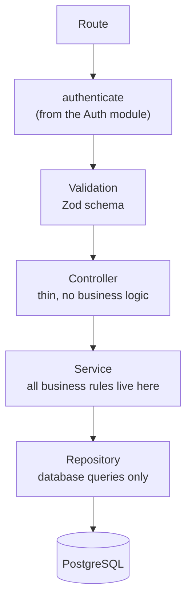
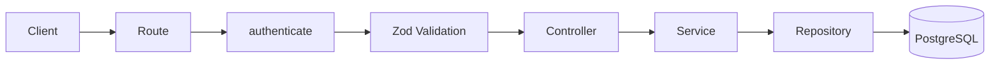
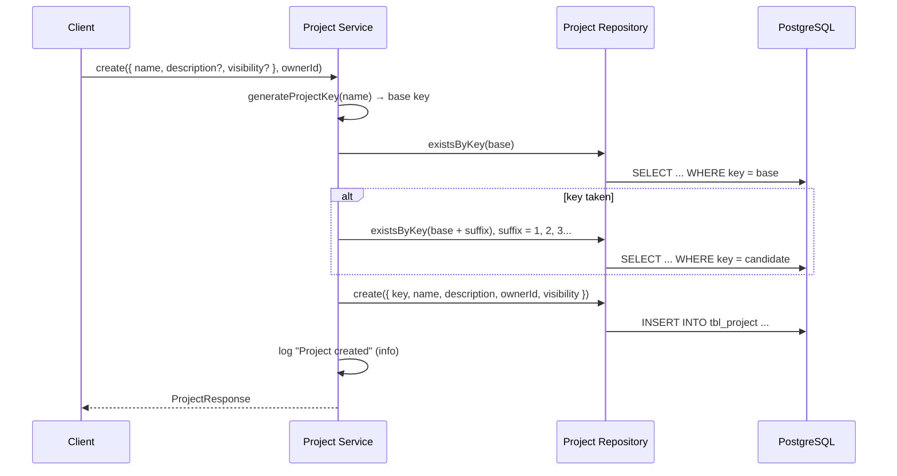
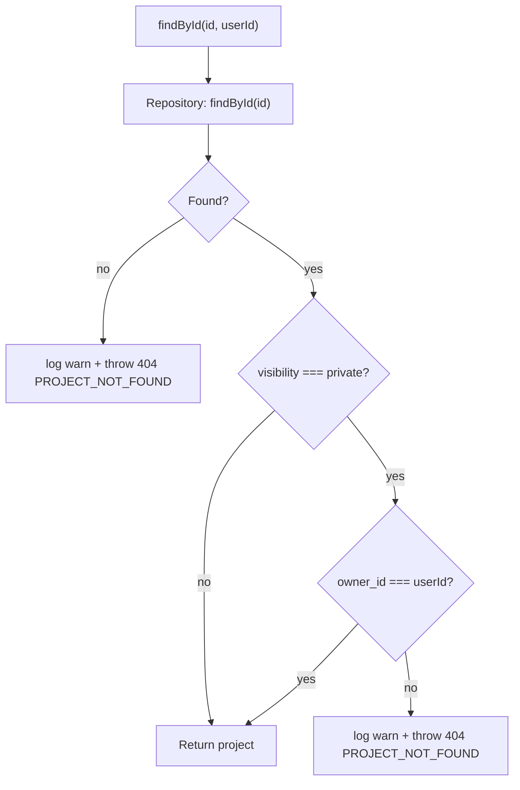
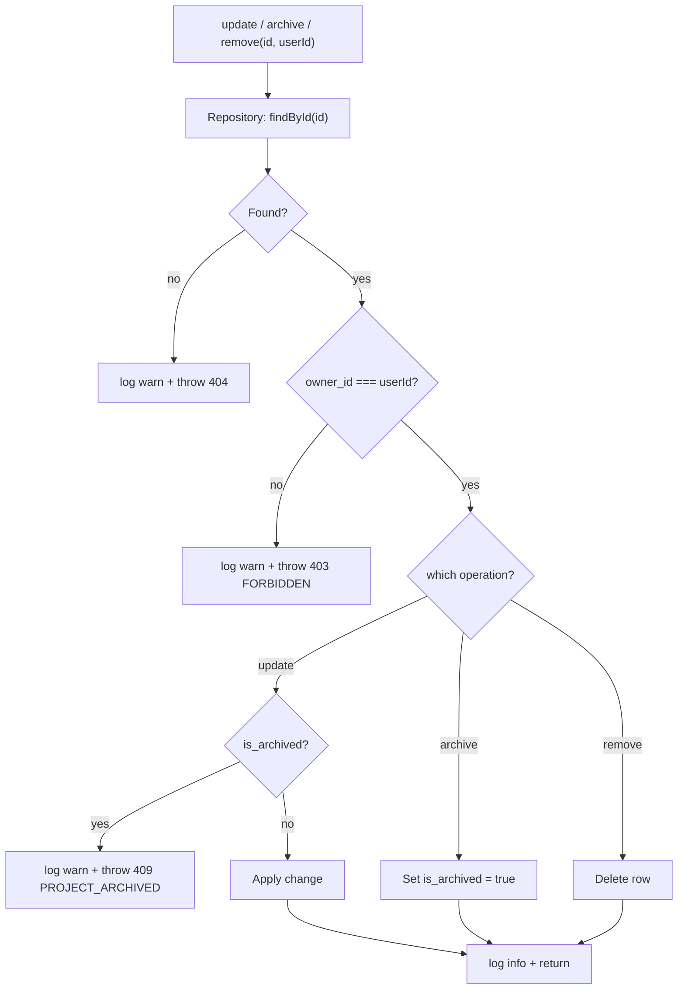
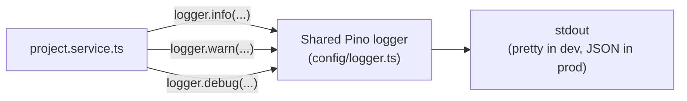

# Projects — Architecture

**Audience:** developers and contributors who want to understand how the system fits together
before reading code. Read [`overview.md`](overview.md) first if you haven't — this document
assumes you already know _why_ the system works this way and focuses on _how_.

## Layered design

The module follows the same layering as [Auth](../auth/architecture.md):

Each layer has exactly one job:

| Layer      | Job                                                                                       | Must NOT do                                   |
| ---------- | ----------------------------------------------------------------------------------------- | --------------------------------------------- |
| Route      | Wire `authenticate` + Zod schema + controller together                                    | Contain logic                                 |
| Middleware | Authenticate the request (imported from Auth — this module owns no middleware of its own) | Touch business rules                          |
| Validation | Reject malformed input before it reaches the controller                                   | —                                             |
| Controller | Read `req`, call one service method, send a response                                      | Talk to the database, know about ownership    |
| Service    | Generate keys, enforce ownership/visibility/archive rules, log operations, map responses  | Know about `req`/`res`                        |
| Repository | Run Drizzle queries against `tbl_project`                                                 | Throw HTTP errors, know about ownership rules |

This is why, for example, the archived-project check lives entirely in `project.service.ts` and
never touches the controller, routes, or repository.

## Request flow

Every route is authenticated first, then validated, then handled — there's no rate limiting or
audit queue on this module today (see [`roadmap.md`](roadmap.md)):

## Create flow

Key generation and uniqueness are entirely the service's responsibility — the repository only
answers "does this exact key exist?" (`existsByKey`), it has no opinion on how keys are built.

## Read flow (`findById`)

Both failure branches return the identical `404 PROJECT_NOT_FOUND` — see
[`security.md`](security.md#private-projects-return-404-not-403) for why "doesn't exist" and "exists
but you can't see it" are deliberately indistinguishable from the outside, even though they're
logged differently on the inside.

## Update / archive / delete flow

All three mutating operations share the same ownership gate before doing anything else:

Note the archived check only exists on the `update` path — archiving and deleting an already
archived project are both still allowed (see [Common Pitfalls in the module README](../../src/modules/projects/README.md#common-pitfalls)).

## Logging architecture

Unlike Auth's queue-ready `AuditLogger` abstraction (built for security-incident review), Projects
uses the shared Pino `logger` directly — this module's logging goal is **operational visibility**
("what happened to this project, and when"), not a security audit trail:

| Level   | When                                                            |
| ------- | --------------------------------------------------------------- |
| `info`  | A mutation succeeded: created, updated, archived, deleted       |
| `warn`  | A request was rejected: not found, forbidden, archived-conflict |
| `debug` | A read succeeded, or a key collision was resolved               |

All log lines include structured context (`projectId`, `userId`/`ownerId`, `operation`) so they're
greppable — see [`security.md`](security.md#operational-logging) for the reasoning and what's
deliberately excluded from them.

## See also

- [`overview.md`](overview.md) — why this system exists, in plain language
- [`security.md`](security.md) — each control and why it exists
- [`roadmap.md`](roadmap.md) — what's planned and how this design accommodates it
- [`src/modules/projects/README.md`](../../src/modules/projects/README.md) — file-by-file implementation reference
