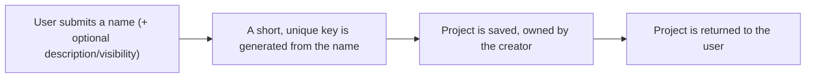
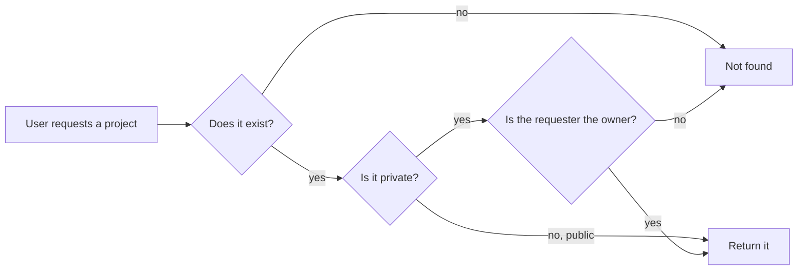
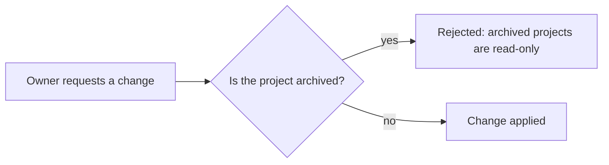

# Projects — Overview

**Audience:** anyone — new contributors, product managers, or a developer returning to this
project after months away. No backend experience assumed.

**Purpose of this document:** explain _why_ the Projects module exists and _what_ it does, before
any implementation detail. For how it's built, see [`architecture.md`](architecture.md). For
security specifics, see [`security.md`](security.md). For what's planned next, see
[`roadmap.md`](roadmap.md).

## Why does this exist?

Kaizen is a project/issue-tracking product. Before there can be an issue, a board, a sprint, or a
report, there has to be a **project** for it to belong to. The Projects module is where that
container is created and managed — it's the first domain module built on top of
[Authentication](../auth/overview.md), and every module that comes after it (Issues, Boards,
Comments, ...) will reference a project by id.

## What can a user do?

| Action            | What it means for the user                                        |
| ----------------- | ----------------------------------------------------------------- |
| Create a project  | Start a new project; the creator automatically becomes its owner  |
| View a project    | See a project's details — their own, or any project marked public |
| List projects     | See every public project plus the ones they own                   |
| Update a project  | Change its name, description, or visibility (owner only)          |
| Archive a project | Mark a project read-only without deleting it (owner only)         |
| Delete a project  | Permanently remove a project (owner only)                         |

## What happens, in plain terms

### Creating a project

A user never types their own project key (e.g. `PROJ`) — it's derived automatically from the name
so it's consistent and guaranteed unique, ready for a future Issue module to build ticket ids like
`PROJ-123` on top of it.

### Reading a project

Notice a private project the requester doesn't own looks exactly like a project that doesn't exist
at all — see [Why visibility failures look like 404s](security.md#private-projects-return-404-not-403)
for the reasoning.

### Changing a project

Only the owner can request a change in the first place — anyone else is rejected before the
archived check even runs.

### Archiving vs. deleting

Archiving and deleting solve different problems. **Archiving** freezes a project — it stops
accepting edits but stays fully visible and intact, useful for a completed project you still want
to reference later. **Deleting** removes a project permanently; there is no undo yet (see
[`roadmap.md`](roadmap.md)).

## What is a project's "key"?

A short, uppercase, letters-only identifier generated once from the project's name and never
changed afterward — e.g. "Project Phoenix" becomes `PROJ`. It exists so that, once the Issue module
is built, individual issues can have short human-readable ids like `PROJ-123` instead of raw UUIDs.
See [Project Key Generation, in the module README](../../src/modules/projects/README.md#project-key-generation)
for the exact algorithm.

## Ownership vs. visibility — two different questions

These are easy to conflate but answer different questions:

- **Ownership** answers "who can _change_ this project?" — exactly one person, the owner.
- **Visibility** answers "who can _see_ this project?" — either just the owner (`private`) or every
  authenticated user (`public`).

A project can be `public` (everyone can see it) while still having exactly one owner (only they
can edit it). Neither implies the other.

## Why these particular design choices?

| Choice                                | Why                                                                                                                                                          |
| ------------------------------------- | ------------------------------------------------------------------------------------------------------------------------------------------------------------ |
| Modular, self-contained module        | Projects can be read, tested, and reasoned about without touching Auth; future modules (Issues, Boards) depend on it, it depends only on Auth for identity   |
| Auto-generated, immutable key         | Guarantees uniqueness and a stable identifier future modules (Issues) can build human-readable ids on top of                                                 |
| Single owner (no membership yet)      | Keeps the first version of this module simple and shippable; membership is a well-understood extension, not a redesign                                       |
| Archive instead of only delete        | Lets a team "close" a project without losing its history, distinct from permanent removal                                                                    |
| Private projects 404 instead of 403   | Doesn't confirm to a non-owner that a private project exists at all — see [`security.md`](security.md)                                                       |
| Operational logging on every mutation | Makes "what happened to this project, and when" answerable from logs without a dedicated audit system — see [`security.md`](security.md#operational-logging) |

## Where to go next

- **Building or reviewing a feature in this area?** → [`architecture.md`](architecture.md)
- **Evaluating or auditing security posture?** → [`security.md`](security.md)
- **Planning what comes after this?** → [`roadmap.md`](roadmap.md)
- **Working directly in the code?** → [`src/modules/projects/README.md`](../../src/modules/projects/README.md)
