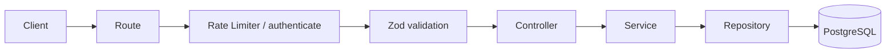

# Authentication Module

Self-contained authentication module for the Kaizen backend: registration, login, access/refresh
tokens, refresh rotation, logout, `/me`, rate limiting, and audit logging.

> Looking for the "why" behind these decisions, or a non-technical explanation? See
> [`docs/auth/`](../../../docs/auth/overview.md). This README covers the "what" and "how" for
> developers working in this module.

## Overview

This module is the single source of truth for "who is making this request." Every other module
(Projects, Issues, Comments, ...) depends on it for identity, but nothing in this module depends on
them — it has no knowledge of any other module's data.

## Responsibilities

- Create accounts and verify credentials (register, login).
- Issue, verify, and rotate JWTs (access + refresh).
- Provide `authenticate` middleware so other modules can protect routes without reimplementing
  token verification.
- Revoke all of a user's sessions at once (logout) without a token blacklist or session store.
- Rate-limit authentication endpoints and expose a reusable rate-limiting primitive for other
  modules.
- Emit audit events for security-relevant actions.

Explicitly **not** this module's job: authorization/permissions, email delivery, MFA, OAuth — see
[Future Roadmap](#future-roadmap).

## Folder Structure

```
src/modules/auth/
├── auth.controller.ts    # Thin HTTP layer: reads req, calls the service, sends a response
├── auth.service.ts       # All business logic — hashing, JWTs, token rotation, audit calls
├── auth.repository.ts    # Persistence only (Drizzle queries against tbl_user)
├── auth.routes.ts        # Route wiring: rate limiter → validation → controller, per endpoint
├── auth.middleware.ts    # `authenticate` — Bearer token verification for protected routes
├── auth.rate-limit.ts    # Concrete limiter instances for this module's routes
├── auth.schema.ts        # Zod request schemas (register/login/refresh)
├── auth.types.ts         # DTOs, JwtPayload, AuthResponse, req.user augmentation
├── auth.constants.ts     # Token types, JWT algorithm allow-list, password policy, error catalogue
├── auth.swagger.ts       # Shared OpenAPI component schemas (securitySchemes, DTOs)
├── README.md
└── __tests__/
    └── auth.test.ts      # Integration tests (supertest, real Postgres)
```

Two pieces of shared infrastructure live outside this module because other modules need them too:

| Path                          | Purpose                                                         |
| ----------------------------- | --------------------------------------------------------------- |
| `src/lib/rate-limit/`         | Generic `createRateLimiter` / `createUserRateLimiter` factories |
| `src/lib/audit/`              | `AuditLogger` interface + default Pino-backed implementation    |
| `config/rate-limit.config.ts` | Env-driven windows/limits, consumed by `auth.rate-limit.ts`     |

## Architecture



Controllers stay thin (parse `req`, call the service, call `successResponse`). All business rules —
password hashing, token issuance, version checks, audit calls — live in `auth.service.ts`. The
repository only runs queries; it throws nothing and knows nothing about HTTP or JWTs.

Full request-flow diagrams per endpoint (register/login/refresh/logout/me) are in
[`docs/auth/architecture.md`](../../../docs/auth/architecture.md).

## Authentication Flow

**Register** — validate → check existing email → hash password → create user → issue tokens →
audit `USER_REGISTERED` → return `{ user, tokens }`.

**Login** — validate → find user by email → compare password → verify account is active → issue
tokens → audit `LOGIN_SUCCEEDED` (or `LOGIN_FAILED` at whichever check failed) → return
`{ user, tokens }`.

**Refresh** — verify refresh token signature, expiry, type, issuer, and audience → load user →
validate JWT version → verify account is active → issue a brand new token pair → audit
`TOKEN_REFRESHED` → return `{ accessToken, refreshToken }`.

**Logout** — authenticate → increment `jwt_version` → audit `USER_LOGGED_OUT` → return success.

**Me** — authenticate → return the authenticated user, re-fetched by `authService.getCurrentUser()`.

## JWT Flow

Every issued token (access or refresh) carries:

```jsonc
{ "sub": "...", "email": "...", "version": 0, "type": "access", "jti": "..." }
```

Signed with `HS256` only. Verification passes an explicit `algorithms` allow-list
(`JWT_ALGORITHMS`) plus the expected `issuer`/`audience` (`JWT_ISSUER`/`JWT_AUDIENCE`) — a token
signed by anything else, or minted for a different service sharing the secret, is rejected before
any of its claims are trusted. `type` is checked explicitly on every verification path, so an
access token can never be used where a refresh token is expected, and vice versa.

## Refresh Token Rotation

`POST /auth/refresh` always issues a **new** access token and a **new** refresh token — the
supplied refresh token's version snapshot becomes stale the moment a new pair is issued, and
callers must persist the newly returned refresh token to keep their session alive. There is no
reuse-detection/blacklist yet (see [Common Pitfalls](#common-pitfalls)).

## JWT Versioning

`version` is a snapshot of the user's `jwt_version` column at the time a token was issued. Every
verification (in `authenticate` and in `refresh`) re-reads the user's _current_ `jwt_version` and
rejects the token if it doesn't match.

**Logout invalidates every session at once**: incrementing `jwt_version` immediately makes every
previously issued access and refresh token fail validation — no token blacklist or server-side
session store required. `jti` is a random UUID that guarantees distinct tokens even when two are
issued within the same second, which is required for a refresh token to actually change under
rotation.

## Rate Limiting

Public endpoints (`/register`, `/login`, `/refresh`) are limited per-IP; `/me` is limited per-user
(falling back to per-IP when unauthenticated). All windows/limits are configurable via env vars —
see [`config/rate-limit.config.ts`](../../../config/rate-limit.config.ts) — and default to values
tuned for brute-force resistance without blocking normal use (e.g. 5 registrations / 15 min,
10 logins / min).

The underlying `createRateLimiter` / `createUserRateLimiter` factories live in
`src/lib/rate-limit/` specifically so other modules can reuse them:

```ts
import { createUserRateLimiter } from "@/lib/rate-limit";

export const projectRateLimiters = {
  create: createUserRateLimiter({ name: "projects.create", windowMs: 60_000, max: 20 }),
};
```

Storage is in-memory today via a single `createRateLimitStore()` factory in
`src/lib/rate-limit/rate-limit.store.ts`; swapping to Redis later means changing that one function,
not any route or call site. All limiters are disabled (passthrough) under `NODE_ENV=test`.

## Audit Logging

`src/lib/audit/auditService.log(...)` is called at every security-relevant decision point in
`auth.service.ts` — never in the controller, so no route can skip it. Events emitted:
`USER_REGISTERED`, `LOGIN_SUCCEEDED`, `LOGIN_FAILED`, `TOKEN_REFRESHED`, `USER_LOGGED_OUT`.

Only non-sensitive context is logged (`userId`, `ip`, event-specific metadata like a failure
reason). **Never** log passwords, tokens, or full request bodies through this service.

Today's implementation just writes structured lines through the existing Pino logger. It's defined
behind an `AuditLogger` interface specifically so it can later be swapped for a queue-backed
implementation (BullMQ/Redis) without touching `auth.service.ts` — see
[`docs/auth/roadmap.md`](../../../docs/auth/roadmap.md).

## Security Decisions

| Decision                         | Summary                                                                                      |
| -------------------------------- | -------------------------------------------------------------------------------------------- |
| bcrypt, 10 salt rounds           | Passwords hashed, never stored or returned in plaintext                                      |
| `PASSWORD_MAX_LENGTH = 72`       | bcrypt silently truncates beyond 72 bytes — rejected instead of accepted                     |
| `password_hash` never serialized | `AuthenticatedUser` only ever contains `id`, `email`, `firstName`, `lastName`                |
| JWT algorithm allow-list         | `algorithms: [...JWT_ALGORITHMS]` on every verify call                                       |
| JWT issuer + audience            | Rejects tokens not minted by/for this service, even if signed with the same secret           |
| Generic auth errors              | `INVALID_CREDENTIALS` regardless of whether the email exists, to prevent account enumeration |
| Deactivated accounts rejected    | Checked on login, refresh, and every authenticated request                                   |

Full rationale for each is in [`docs/auth/security.md`](../../../docs/auth/security.md) — this
table is a reference, not the explanation.

## Extension Points

| Need                           | Extend                                                                                               |
| ------------------------------ | ---------------------------------------------------------------------------------------------------- |
| A new module needs auth        | Import `authenticate` from `auth.middleware.ts`                                                      |
| A new module needs rate limits | Import from `src/lib/rate-limit`, do **not** copy this module's limiter setup                        |
| A new consumer of audit events | Add a new `AuditEventKey` in `src/lib/audit/audit.types.ts`, or swap `auditService`'s implementation |
| A new JWT claim (e.g. `role`)  | Extend `JwtPayload` and `AuthenticatedUser` in `auth.types.ts`                                       |

## Future Roadmap

Email verification, password reset, MFA, OAuth, SSO, session/device management, and background
workers are intentionally not implemented here. See
[`docs/auth/roadmap.md`](../../../docs/auth/roadmap.md) for what's planned and how the current
design already accommodates each.

## Important Implementation Notes

- Config is validated with Zod at boot (`config/env.ts`); the process refuses to start rather than
  run with missing/invalid JWT or rate-limit settings.
- `generateTokens` signs both access and refresh tokens with the same secret, issuer, and audience
  — they're distinguished **only** by the `type` claim. Every verification path checks it
  explicitly; don't assume signature validity implies correct token type.
- Controllers pass `{ ip: req.ip }` into every service call that can emit an audit event. If you
  add a new authenticated action, thread the same context through rather than reading `req`
  directly inside the service.
- Rate limiter `handler()` callbacks log a `warn` on every 429 (limiter name, IP, path) — check
  logs, not just response codes, when debugging limiter behavior in production.

## Common Pitfalls

- **Mount order matters for user-based rate limiting.** `createUserRateLimiter` reads
  `req.user`, so it must be mounted _after_ `authenticate` on the route. Mounting it first means
  every request silently falls back to IP-based keying — the code still runs, it just isn't doing
  what it looks like it's doing.
- **Rate limiters are inert in tests.** `NODE_ENV=test` bypasses every limiter entirely
  (`src/lib/rate-limit/rate-limit.factory.ts`). Don't write integration tests that assert on 429s;
  if you need to test limiter logic itself, test the factory in isolation.
- **`req.ip` is only trustworthy if `TRUST_PROXY` matches your deployment.** Behind a reverse
  proxy/load balancer with `TRUST_PROXY` left at its default of `0`, every request appears to come
  from the proxy's IP, and IP-based rate limiting effectively rate-limits _everyone_ together.
- **The rate-limit store is in-memory and per-process.** Multiple instances behind a load balancer
  each keep their own counters — a client can get roughly `N × instance count` requests through
  before being limited. Not a bug, just not yet horizontally correct; see the roadmap.
- **Audit logs are log lines, not a database.** They're structured and greppable, but there's no
  retention/query guarantee beyond whatever your log pipeline provides. Don't treat them as a
  compliance-grade audit trail until a persistent sink is added.

## Environment Variables

| Variable                                    | Description                                           | Default          |
| ------------------------------------------- | ----------------------------------------------------- | ---------------- |
| `JWT_SECRET`                                | HMAC signing secret shared by access & refresh tokens | —                |
| `JWT_ACCESS_EXPIRES_IN`                     | Access token lifetime (e.g. `15m`, `1d`)              | —                |
| `JWT_REFRESH_EXPIRES_IN`                    | Refresh token lifetime (e.g. `7d`, `30d`)             | —                |
| `JWT_ISSUER`                                | Expected `iss` claim on every token                   | `kaizen-backend` |
| `JWT_AUDIENCE`                              | Expected `aud` claim on every token                   | `kaizen-app`     |
| `TRUST_PROXY`                               | Reverse-proxy hop count Express trusts for `req.ip`   | `0`              |
| `RATE_LIMIT_AUTH_REGISTER_WINDOW_MS`/`_MAX` | Register limiter window/cap                           | `900000` / `5`   |
| `RATE_LIMIT_AUTH_LOGIN_WINDOW_MS`/`_MAX`    | Login limiter window/cap                              | `60000` / `10`   |
| `RATE_LIMIT_AUTH_REFRESH_WINDOW_MS`/`_MAX`  | Refresh limiter window/cap                            | `60000` / `30`   |
| `RATE_LIMIT_AUTH_ME_WINDOW_MS`/`_MAX`       | `/me` limiter window/cap                              | `60000` / `100`  |

## API Endpoints

All routes are mounted at `${API_PREFIX}/auth` (e.g. `/api/auth`).

| Method | Path        | Auth required              | Rate limit | Description                                            |
| ------ | ----------- | -------------------------- | ---------- | ------------------------------------------------------ |
| POST   | `/register` | No                         | Per-IP     | Create a user, returns `{ user, tokens }`              |
| POST   | `/login`    | No                         | Per-IP     | Authenticate, returns `{ user, tokens }`               |
| POST   | `/refresh`  | No (refresh token in body) | Per-IP     | Rotate tokens, returns `{ accessToken, refreshToken }` |
| POST   | `/logout`   | Yes (Bearer access token)  | None       | Invalidate all sessions for the user                   |
| GET    | `/me`       | Yes (Bearer access token)  | Per-user   | Return the authenticated user                          |

Full request/response schemas are documented via Swagger at `/api/docs`.
