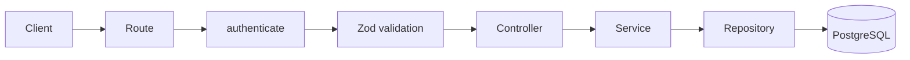

# Projects Module

Self-contained project-management module for the Kaizen backend: project creation, retrieval,
listing, updates, archiving, and deletion.

## Overview

Projects are the primary aggregate of the domain model — every issue, board, sprint, and report
that will be built in future modules belongs to a project. This module owns project lifecycle,
metadata, ownership, and visibility. It depends on the [Auth module](../auth/README.md) for
identity (`authenticate`, `req.user`) but nothing in Auth depends on Projects.

## Responsibilities

- Create, read, list, update, archive, and delete projects.
- Generate a short, unique, immutable project key on creation.
- Enforce single-owner authorization: only the owner may update, archive, or delete.
- Enforce visibility: `public` projects are readable by any authenticated user, `private` projects
  only by their owner.

Explicitly **not** this module's job: project members, roles/permissions, issues, boards, comments
— see [Future Extension Points](#future-extension-points).

## Folder Structure

```
src/modules/projects/
├── project.controller.ts   # Thin HTTP layer: reads req, calls the service, sends a response
├── project.service.ts      # All business logic — key generation, ownership, visibility, mapping
├── project.repository.ts   # Persistence only (Drizzle queries against tbl_project)
├── project.routes.ts       # Route wiring: authenticate → validation → controller, per endpoint
├── project.schema.ts       # Zod request schemas (create/update/id)
├── project.types.ts        # DTOs and ProjectResponse
├── project.constants.ts    # Field limits, key-generation rules, error catalogue
├── project.swagger.ts      # Shared OpenAPI component schemas
├── README.md
└── __tests__/
    └── project.test.ts     # Integration tests (supertest, real Postgres)
```

## Architecture



Controllers stay thin (parse `req`, call the service, call `successResponse`). All business rules —
key generation, ownership checks, archive-immutability, response mapping — live in
`project.service.ts`. The repository only runs queries; it throws nothing and knows nothing about
HTTP or authorization.

## Project Lifecycle

**Create** — validate request → generate a project key from the name → ensure the key is unique
(append a numeric suffix on collision) → persist → return the project, owned by the caller.

**Read (single)** — load the project → if it's `private` and the caller isn't the owner, respond
`404` (not `403`) so a private project's existence isn't leaked → return the project.

**List** — return every `public` project plus the projects owned by the caller.

**Update** — load the project → require the caller to be the owner → require the project not be
archived → apply changes → return the updated project.

**Archive** — load the project → require the caller to be the owner → set `is_archived = true` →
return the updated project.

**Delete** — load the project → require the caller to be the owner → delete permanently. There is
no soft delete yet (see [Future Extension Points](#future-extension-points)).

## Ownership Model

Every project has exactly one owner, set from `req.user.id` at creation time — clients cannot
choose the owner. Only the owner may update, archive, or delete a project; every other
authenticated user gets `403 FORBIDDEN`. Ownership transfer and multi-owner/member support are
future work; there is no membership table yet.

## Visibility Model

| Value     | Who can read it          |
| --------- | ------------------------ |
| `private` | Only the owner (default) |
| `public`  | Any authenticated user   |

Because there's no membership system yet, "visible to members" for a `private` project currently
means "visible to the owner only." When membership lands, the same check in
`project.service.ts#loadAccessibleProject` is the single place that needs to grow to include
members.

## Project Key Generation

Every project gets a short, uppercase, letters-only key, generated once at creation and never
editable:

1. Strip everything but letters from the project name and uppercase it.
2. Take the first `PROJECT_KEY_BASE_LENGTH` (4) letters as the base key. If the name has fewer than
   `PROJECT_KEY_MIN_LENGTH` (2) letters, fall back to `PROJECT_KEY_FALLBACK` (`"PRJ"`).
3. If the base key is already taken, append an incrementing numeric suffix (`API` → `API1` →
   `API2` → ...) until a unique key is found.

```
"Project Phoenix" → "PROJ"
"API" (already exists) → "API1"
```

This logic lives entirely in `project.service.ts` (`generateProjectKey` / `ensureUniqueKey`) — the
repository only exposes `existsByKey` and knows nothing about the generation algorithm.

## Business Rules

| Field         | Rule                                                             |
| ------------- | ---------------------------------------------------------------- |
| `name`        | Required, 3–100 characters                                       |
| `description` | Optional, up to 2000 characters                                  |
| `key`         | Auto-generated, immutable, unique, uppercase letters, 2–10 chars |
| `visibility`  | `private` (default) or `public`                                  |

Archived projects cannot be updated (`409 PROJECT_ARCHIVED`); deletion is permanent for both
archived and active projects.

## Environment Variables

None. This module has no configuration of its own — it uses the shared `DATABASE_URL` and the
`authenticate` middleware's JWT settings from the [Auth module](../auth/README.md#environment-variables).

## API Endpoints

All routes are mounted at `${API_PREFIX}/projects` (e.g. `/api/projects`) and require a Bearer
access token.

| Method | Path           | Owner-only | Description                                               |
| ------ | -------------- | ---------- | --------------------------------------------------------- |
| POST   | `/`            | —          | Create a project, owned by the caller                     |
| GET    | `/`            | —          | List public projects plus the caller's own projects       |
| GET    | `/:id`         | —          | Get a single project (`404` if private and not the owner) |
| PATCH  | `/:id`         | Yes        | Update name/description/visibility (rejected if archived) |
| PATCH  | `/:id/archive` | Yes        | Archive a project                                         |
| DELETE | `/:id`         | Yes        | Permanently delete a project                              |

Full request/response schemas are documented via Swagger at `/api/docs`.

## Error Codes

| Code                    | Status | Meaning                                              |
| ----------------------- | ------ | ---------------------------------------------------- |
| `VALIDATION_ERROR`      | 400    | Request body/params failed Zod validation            |
| `UNAUTHORIZED`          | 401    | Missing/invalid/expired access token                 |
| `FORBIDDEN`             | 403    | Caller is not the project owner                      |
| `PROJECT_NOT_FOUND`     | 404    | Project doesn't exist, or is private and not visible |
| `PROJECT_ARCHIVED`      | 409    | Attempted to update an archived project              |
| `KEY_GENERATION_FAILED` | 500    | Exhausted key-suffix attempts (extremely unlikely)   |

## Extension Points

| Need                                  | Extend                                                                           |
| ------------------------------------- | -------------------------------------------------------------------------------- |
| Project members / roles / permissions | New module; extend `loadAccessibleProject` and `validateOwner` in the service    |
| Ownership transfer                    | New service method that reassigns `owner_id`; no schema change needed            |
| Soft deletion                         | Add a `deleted_at` column and filter it in the repository instead of hard-delete |
| Project settings/avatars/templates    | New columns or a related table; keep this module scoped to core lifecycle        |

## Common Pitfalls

- **Private-project reads return 404, not 403.** This is intentional — it avoids confirming a
  private project's existence to non-owners. Don't "fix" this to 403 without also reconsidering the
  information leak.
- **The project key is immutable by design.** There is no `key` field in `updateProjectSchema`; do
  not add one without updating this document and the future Issue module, which will depend on keys
  being stable (`PROJ-123`).
- **Archived is a one-way gate for updates, not for reads or deletes.** Archived projects still
  show up in list/get and can still be deleted — only `PATCH /:id` is blocked.
